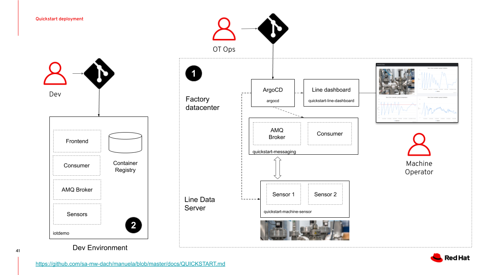

# Quick start and first steps <!-- omit in toc -->

By following these steps you will create your own instance of the manuela gitops repository and use it to deploy and configure an application via GitOps to a single OpenShift cluster, such as CodeReady Containers (CRC).

- [Prequisites](#prequisites)
- [Quickstart deployment](#quickstart-deployment)
- [Prepare your own instance of the gitops repository](#prepare-your-own-instance-of-the-gitops-repository)
- [Prepare Cluster and deploy ArgoCD](#prepare-cluster-and-deploy-argocd)
- [Deploy the Application via GitOps](#deploy-the-application-via-gitops)
- [Configure the Application via GitOps](#configure-the-application-via-gitops)
- [Build the Application Components from Source](#build-the-application-components-from-source)
- [Modify GitOps repo to deploy your own application components](#modify-gitops-repo-to-deploy-your-own-application-components)

## Prequisites

- **Local Workstation**: You have the ```git``` and ```oc``` command line clients installed
- **OpenShift Cluster**: You are logged into your cluster as cluster admin in via the ```oc```command line client
- **GitHub Account**: You are logged into GitHub and can fork public repositories

## Quickstart deployment

You are going to deploy two manuela instances:

1. The simplified showcase for a production deployment.
2. A development environment for building your own container images.




## Prepare your own instance of the gitops repository

Fork [https://github.com/sa-mw-dach/manuela-gitops.git](https://github.com/sa-mw-dach/manuela-gitops.git) into your own GitHub organisation (you will need to make changes in this repo).

Clone the forked repo to your local home directory (you can chose a different base directory and repo name, but this document assumes the repo is present under ~/manuela-gitops):
```bash
cd ~

git clone https://github.com/<organisation>/manuela-gitops.git
```

Configure ArgoCD applications to point to your upstream gitops repo. Note: on OSX, the sed syntax is slightly different, you need to add an extra quotation marks after the -i: ```sed -i "" "s|....```.

```bash
cd ~/manuela-gitops

REPOURL=$(git remote get-url origin | sed "s|git@github.com:|https://github.com/|")

sed -i "s|repoURL:.*|repoURL: $REPOURL|" meta/argocd-quickstart.yaml \
  config/instances/manuela-quickstart/manuela-quickstart-line-dashboard-application.yaml \
  config/instances/manuela-quickstart/manuela-quickstart-messaging-application.yaml \
  config/instances/manuela-quickstart/manuela-quickstart-machine-sensor-application.yaml

git add .

git commit -m "adapt repo URLs"

git push
```

If you are NOT using CRC, adapt the gitops configuration to match your environment's base URL:
```
export OCP_WILDCARD_DOMAIN=apps.my.openshift.cluster

cd ~/manuela-gitops/config/instances/manuela-quickstart

sed -i  "s|apps-crc.testing|$OCP_WILDCARD_DOMAIN|" line-dashboard/line-dashboard-configmap.yaml \
  line-dashboard/line-dashboard-route.yaml machine-sensor/machine-sensor-1-configmap.properties \
  machine-sensor/machine-sensor-2-configmap.properties messaging/route.yaml

git add .

git commit -m "adapt base DNS names"

git push
```

## Prepare Cluster and deploy ArgoCD

Create "iotdemo" and "argocd" namespaces and required operator subscriptions: 
```bash
oc apply -f https://raw.githubusercontent.com/sa-mw-dach/manuela/master/quickstart/01_namespaces_and_operators.yaml
```

Create ArgoCD instance:
```bash
oc apply -f https://raw.githubusercontent.com/sa-mw-dach/manuela/master/quickstart/02_argocd.yaml
```

These two steps are performed separately due to the lifecycle of the operator and the custom resources it manages. The first step creates operator subscriptions which in turn advises the OLM to instantiate the operator, which then registers its CRD in the system. Only once the CRDs are registered, the custom resources can be created. This is why these two things cannot be done in a single transaction.

Wait for all ArgoCD pods to run:
```bash
oc get pods -n argocd

NAME                                             READY   STATUS    RESTARTS   AGE
argocd-application-controller-657d65dc78-tczgh   1/1     Running   0          17m
argocd-dex-server-76fb48bf6-4rmq2                1/1     Running   2          17m
argocd-operator-65dcf99d75-p2r9x                 1/1     Running   0          21m
argocd-redis-79ff859f65-9stcm                    1/1     Running   0          17m
argocd-repo-server-7dd7d7f568-jtgp2              1/1     Running   0          17m
argocd-server-85dff996b4-2vh6t                   1/1     Running   0          17m
```

Create gitops deployment agent configuration for the quickstart environment:
```bash
cd ~/manuela-gitops

oc apply -f meta/argocd-quickstart.yaml
```

Log into the ArgoCD WebUI (select OpenShift auth) and see only the quickstart deployment agent configuration is present. Retrieve the URL via:
```bash
echo https://$(oc -n argocd get route argocd-server -o jsonpath='{.spec.host}')
```

## Deploy the Application via GitOps

Deploy the quickstart application by symlinking the component instance applications in the quickstart deployment folder of the gitops repo:
```bash
cd ~/manuela-gitops/deployment/execenv-quickstart

ln -s ../../config/instances/manuela-quickstart/manuela-quickstart-line-dashboard-application.yaml

ln -s ../../config/instances/manuela-quickstart/manuela-quickstart-machine-sensor-application.yaml

ln -s ../../config/instances/manuela-quickstart/manuela-quickstart-messaging-application.yaml

git add .

git commit -m "deploy application"

git push
```

Wait for ArgoCD to sync the changed configuration (you can also trigger a sync via the ArgoCD UI). 


Open the Manuela line dashboard web application and view the sensor data by selecting the "Realtime Data" menu item. Retrieve the UI URL via:
```bash
echo http://$(oc -n manuela-quickstart-line-dashboard get route line-dashboard -o jsonpath='{.spec.host}')/sensors
```

## Configure the Application via GitOps

Enable the second temperature sensor via GitOps:
```bash
cd ~/manuela-gitops

sed -i "s|SENSOR_TEMPERATURE_ENABLED.*|SENSOR_TEMPERATURE_ENABLED=true|" \
config/instances/manuela-quickstart/machine-sensor/machine-sensor-2-configmap.properties

git add .

git commit -m "enable temperature sensor"

git push
```

Wait for ArgoCD to sync the changed configuration (you can also trigger a sync via the ArgoCD UI). The new sensor data will appear in the Web UI.


## Build the Application Components from Source

Create build configurations and deployments for the components in the ```iotdemo``` namespace:
```bash
oc apply -f https://raw.githubusercontent.com/sa-mw-dach/manuela/master/quickstart/03_components.yaml
```

These build configs point to the [https://github.com/sa-mw-dach/manuela-dev](https://github.com/sa-mw-dach/manuela-dev) repository. Use ```oc edit``` to point them to your own fork of the repository if you wish.

## Modify GitOps repo to deploy your own application components

Modify the quickstart instance configuration to point to the freshly built images in the iotdemo namespace in the same cluster.

```bash
cd ~/manuela-gitops/config/instances/manuela-quickstart

sed -i -e "s|newName:.*|newName: image-registry.openshift-image-registry.svc:5000/iotdemo/iot-consumer|" -e "s|newTag:.*|newTag: latest|" messaging/kustomization.yaml

sed -i -e "s|newName:.*|newName: image-registry.openshift-image-registry.svc:5000/iotdemo/iot-frontend|" -e "s|newTag:.*|newTag: latest|" line-dashboard/kustomization.yaml

sed -i -e "s|newName:.*|newName: image-registry.openshift-image-registry.svc:5000/iotdemo/iot-software-sensor|" -e "s|newTag:.*|newTag: latest|" machine-sensor/kustomization.yaml

git add .

git commit -m "modify quickstart instance to use iotdemo images"

git push
```

Wait for ArgoCD to sync the changed configuration (you can also trigger a sync via the ArgoCD UI).

Validate that the **local images** (image-registry.openshift-image-registry.svc:5000) are configured.

```bash
oc get deployment line-dashboard -n manuela-quickstart-line-dashboard -o yaml | grep image:
      - image: image-registry.openshift-image-registry.svc:5000/iotdemo/iot-frontend:latest


oc get deployment machine-sensor-1 -n manuela-quickstart-machine-sensor -o yaml | grep image:
        image: image-registry.openshift-image-registry.svc:5000/iotdemo/iot-software-sensor:latest
        
oc get deployment machine-sensor-2 -n manuela-quickstart-machine-sensor -o yaml | grep image:
        image: image-registry.openshift-image-registry.svc:5000/iotdemo/iot-software-sensor:latest
        
        
oc get deployment messaging -n  manuela-quickstart-messaging -o yaml | grep image:
        image: image-registry.openshift-image-registry.svc:5000/iotdemo/iot-consumer:latest


```
