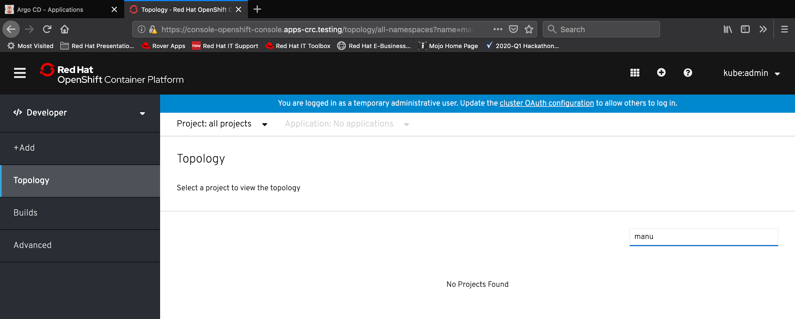
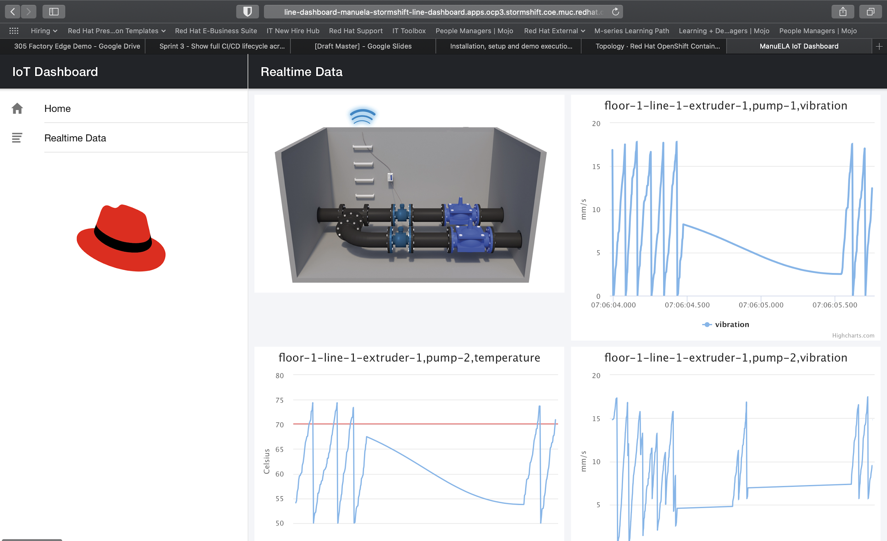
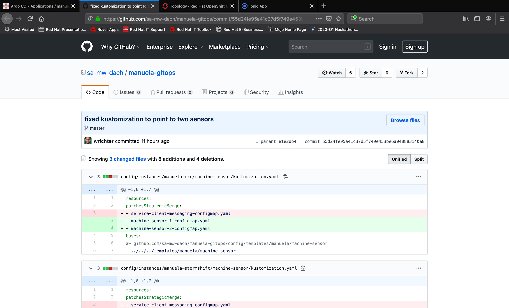
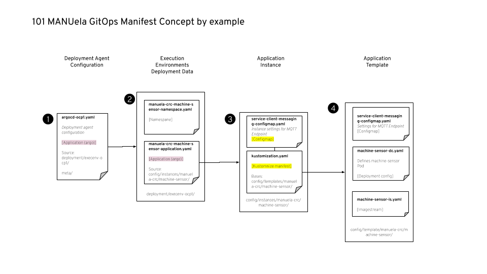
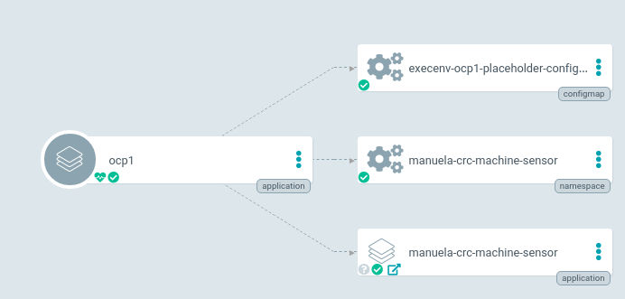
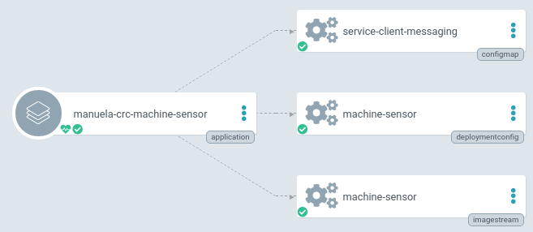
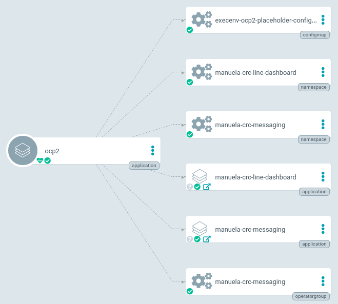
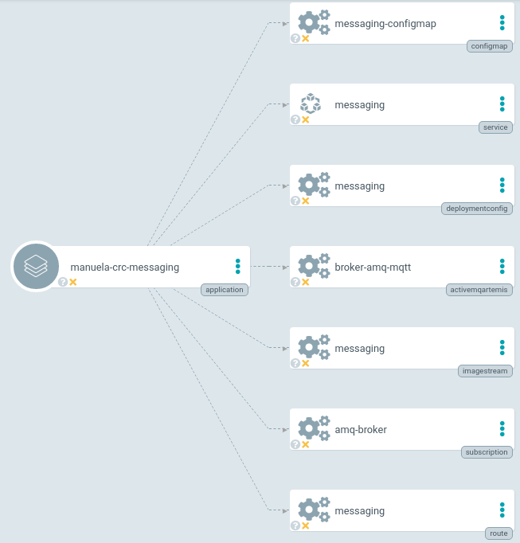
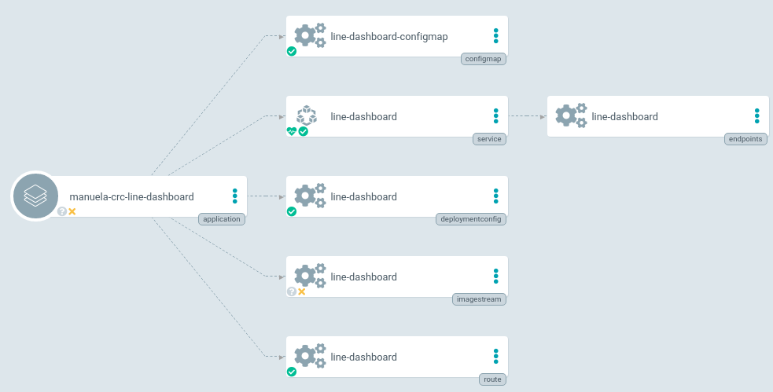
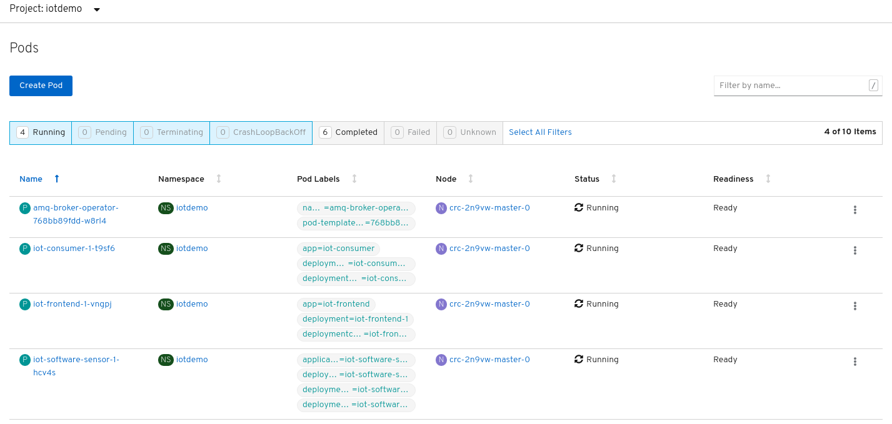

# MANUela


# Preface
This project is build and maintained by a group of solution architects at Red Hat. It originated from SAs responsible for diverse manufacturing customers in Germany and has grown to include other verticals as well. 

There are also further MANUela-linked projects for GitOps, ArgoCD and some demo apps to be deployed within the demo. 
You can check them out in this Github directory https://github.com/sa-mw-dach .

CAVEAT: Some of the technologies involved are bleeding edge, and so implementation details might change if a better tool is found for a particular purpose.  

**Please track any demo in the following sheet so we can understand how it is used:**

[https://docs.google.com/spreadsheets/d/17846bqUPEbXUmJ2i6KUYJ_k0yiJWmVW4flhKb83WDA4/edit#gid=0](https://docs.google.com/spreadsheets/d/17846bqUPEbXUmJ2i6KUYJ_k0yiJWmVW4flhKb83WDA4/edit#gid=0)


## Purpose
Show an exemplary horizontal solution blueprint for IoT Edge use cases applicable to different verticals.
## Intended audience
Everyone who needs to showcase IoT Edge use cases for the various verticals. New modules or enhancements to existing ones are always welcome.
## Possible use cases
IoT Edge with 5G, Machine Learning, OpenShift Multi-Cluster, Application Integration
# Conventions
## Naming
## Chapter structure
# Glossary
# Prerequisites and basic setup
First target environments are Stormshift and CRC
## OpenShift 
OCP 4.2+ is installed and running
## Check out manuela-dev repository
Check out manuela-dev repository
```bash
cd ~
git clone https://github.com/sa-mw-dach/manuela-dev.git
```
## Argo CD
### Installing ArgoCD on OpenShift

Source: [https://blog.openshift.com/introduction-to-gitops-with-openshift/](https://blog.openshift.com/introduction-to-gitops-with-openshift/)

In order to deploy ArgoCD on OpenShift 4.x you can go ahead and follow the following steps as a cluster admin:

#### Deploy ArgoCD components on OpenShift via Operator
```bash
cd ~/manuela-dev/infrastructure
oc apply -k argocd
oc apply -k argocd
oc adm policy add-cluster-role-to-user cluster-admin -n argocd -z argocd-application-controller
```

#### Check pods and routes
```bash
oc get pods

NAME                                             READY   STATUS    RESTARTS   AGE
argocd-application-controller-7b96cb74dd-lst94   1/1     Running   0          12m
argocd-dex-server-58f5b5b44f-cfsw5               1/1     Running   0          12m
argocd-redis-868b8cb57f-dc6fl                    1/1     Running   0          12m
argocd-repo-server-5bf79d67f4-hvnwx              1/1     Running   0          12m
argocd-server-888f8b6b8-scvll                    1/1     Running   0          7m16s

oc get routes

NAME            HOST/PORT                               PATH   SERVICES        PORT   TERMINATION     WILDCARD
argocd-server   argocd-server-argocd.apps-crc.testing          argocd-server   http   edge/Redirect   None
```

<!--##### Deploy ArgoCD
Create a new namespace for ArgoCD components
```
oc new-project argocd
```
Grant access to manuela-team:
```
oc policy add-role-to-group admin manuela-team
```
Apply the ArgoCD Install Manifest
```bash
oc apply -n argocd -f https://raw.githubusercontent.com/argoproj/argo-cd/v1.4.2/manifests/install.yaml**
```
Get the ArgoCD Server password
```bash
ARGOCD_SERVER_PASSWORD=$(oc -n argocd get pod -l "app.kubernetes.io/name=argocd-server" -o jsonpath='{.items[*].metadata.name}')**
echo $ARGOCD_SERVER_PASSWORD**
```
#### Patch ArgoCD Server Deployment so we can expose it using an OpenShift Route

Patch ArgoCD Server so no TLS is configured on the server (--insecure)
```bash
PATCH='{"spec":{"template":{"spec":{"$setElementOrder/containers":[{"name":"argocd-server"}],"containers":[{"command":["argocd-server","--insecure","--staticassets","/shared/app"],"name":"argocd-server"}]}}}}'
oc -n argocd patch deployment argocd-server -p $PATCH
```
Expose the ArgoCD Server using an Edge OpenShift Route so TLS is used for incoming connections
```
oc -n argocd create route edge argocd-server --service=argocd-server --port=http --insecure-policy=Redirect
```
-->
#### Deploy ArgoCD Cli Tool (optional)

Download the argocd binary, place it under /usr/local/bin and give it execution permissions
```bash
sudo curl -L https://github.com/argoproj/argo-cd/releases/download/v1.4.1/argocd-linux-amd64 -o /usr/local/bin/argocd
sudo chmod +x /usr/local/bin/argocd
```

#### Update ArgoCD Server Admin Password 
<!--##### via ArgoCD CLI
Get ArgoCD Server Route Hostname using argocd CLI
```bash
ARGOCD_ROUTE=$(oc -n argocd get route argocd-server -o jsonpath='{.spec.host}')
```
Login with the current admin password
```bash
argocd --insecure --grpc-web login ${ARGOCD_ROUTE}:443 --username admin --password ${ARGOCD_SERVER_PASSWORD}
```
Update admin's password
```bash
argocd --insecure --grpc-web --server ${ARGOCD_ROUTE}:443 account update-password --current-password ${ARGOCD_SERVER_PASSWORD} --new-password admin
```
##### using OC CLI -->
```bash
oc -n argocd patch secret argocd-secret  -p '{"stringData": { "admin.password": "'$(htpasswd -nbBC 10 admin admin | awk '{print substr($0,7)}')'", "admin.passwordMtime": "'$(date +%FT%T%Z)'" }}'
```

#### Allow any auth users to be ArgoCD Admins
```bash
oc -n argocd patch configmap argocd-rbac-cm -p '{"data":{"policy.default":"role:admin"}}'
oc delete pods -n argocd --all
```
Now you should be able to use the ArgoCD WebUI and the ArgoCD Cli tool to interact with the ArgoCD Server

#### Login into Argo web UI

E.g. [https://argocd-server-argocd.apps-crc.testing/applications](https://argocd-server-argocd.apps-crc.testing/applications) 

User: admin, Password: admin - or log in via openshift auth

OCP3 Cluster: [https://argocd-server-argocd.apps.ocp3.stormshift.coe.muc.redhat.com/](https://argocd-server-argocd.apps.ocp3.stormshift.coe.muc.redhat.com/)


#### To-do: Test Installation of Argo CD which requires only namespace level privileges

[https://github.com/argoproj/argo-cd/tree/master/manifests](https://github.com/argoproj/argo-cd/tree/master/manifests)

### Prepare Container Images by building and Deploying Manuela-Dev

#### Build MANUela Containers in iotdemo namespace

Build manuela app on clusters so that imagestreams and images in local registry exist
```bash
cd ~/manuela-dev/components
```
Adjust the ConfigMaps to the target environment
```bash
diff --git a/components/iot-frontend/manifests/iot-frontend-configmap.yaml b/components/iot-frontend/manifests/iot-frontend-configmap.yaml

index dac9161..363152e 100644
--- a/components/iot-frontend/manifests/iot-frontend-configmap.yaml
+++ b/components/iot-frontend/manifests/iot-frontend-configmap.yaml

@@ -5,7 +5,7 @@ metadata:
 data:
   config.json: |-
     {
-        "websocketHost": "http://iot-consumer-iotdemo.apps.ocp4.stormshift.coe.muc.redhat.com",
+        "websocketHost": "http://iot-consumer-iotdemo.apps.ocp3.stormshift.coe.muc.redhat.com",
         "websocketPath": "/api/service-web/socket",
         "SERVER_TIMEOUT": 20000
     }
\ No newline at end of file
```
#### Adjust the Quay Secret

Login to [https://quay.io/organization/manuela?tab=robots](https://quay.io/organization/manuela?tab=robots)

Copy to .dockerconfigjson from the robo account "manuela-build" to the clipboard

Paste it to the manuela-dev/components/iot-demo-secrets.yaml into the <<replace_me_with_value_from_quay.io_robo_account>>

#### Trigger Build & Deploy on Dev Cluster

run the following commands twice since the first invocation will partially fail due to the AMQbroker CRD taking a while to be available
```bash
oc apply -k .
oc apply -k .
```
#### Configure ArgoCD deployment agent

The following clones the manuela-gitops repo into your home directory. Should you choose to put it somewhere else, you need to adapt all following commands accordingly.
```bash
cd ~
git clone ****[git@github.co**m](mailto:git@github.com)**:sa-mw-dach/manuela-gitops.git
cd ~/manuela-gitops/meta/
```
Choose your target execution environment, this example uses ocp3
```bash
oc apply -n argocd -f argocd-<yourtargetenv>.yaml

application.argoproj.io/ocp3 created
```
To remove:
```bash
oc delete -n argocd -f argocd-<yourtargetenv>.yaml

application.argoproj.io "ocp3" deleted
```
## Set up CI/CD Pipeline

### Deploy OpenShift Pipelines aka Tekton via Operator

OCP V4.2+: 

Either follow instructions to deploy Tekton via operator here: [https://github.com/openshift/pipelines-tutorial/blob/master/install-operator.md](https://github.com/openshift/pipelines-tutorial/blob/master/install-operator.md) or create it declaratively:
```bash
cd ~/manuela-dev/infrastructure/openshift-pipelines
oc apply -k .
```


### Instantiate MANUela CI project
```bash
cd ~/manuela-dev/tekton
oc apply -k .
```
This creates the manuela-ci project, pipelines, etc...

### Prepare & create secrets

Background: We can’t store git secrets in git, and have not yet handled vault/secret management. Thus, you need to manually add your personal git or quay robo account secret)
```bash
cd ~/manuela-dev/tekton/secrets
cp github-example.yaml github.yaml
```
You have to adjust secret with personal access token of a github user that can push to the repo:
```bash
vi github.yaml
cp quay-build-secret-example.yaml quay-build-secret.yaml
```
Adjust secret with dockerconfig of a quay robo account with push permissions

Login to [https://quay.io/organization/manuela?tab=robots](https://quay.io/organization/manuela?tab=robots)

Copy to .dockerconfigjson from the robo account "manuela-build" to the clipboard

Paste it to the .dockerconfigjson attribute in the yaml:
```bash
vi quay-build-secret.yaml
oc apply -k .
```
## CodeReady Workspaces as Cloud IDE for manuela-dev

### Setting up CRW

The Kubernetes artifacts to set up CRW are located in the manuela-dev git repository.
```bash
cd ~/manuela-dev/infrastructure/crw
oc apply -k .
```
This will create the following: 

1. Create a new project manuela-crw in the current logged in OCP

2. Create an OperatorGroup CR to make the OLM aware of an operator in this namespace

3. Create an CRW Operator Subscription from the latest stable channel -> installs the CRW operator in the namespace manuela-crw

4. Create an actual CheCluster in the namespace manuela-crw with following custom properties:

    1. customCheProperties:

    2.      CHE_LIMITS_USER_WORKSPACES_RUN_COUNT: '10'

    3.      CHE_LIMITS_WORKSPACE_IDLE_TIMEOUT: '-1'

CRW should be available after about 3-5 minutes.

### Login to CRW

Look for the Route with the name **codeready:**
```bash
oc project manuela-crw
oc get routes
```


To verify deployment, you can login to CRW: [https://codeready-manuela-crw.apps.ocp3.stormshift.coe.muc.redhat.com/](https://codeready-manuela-crw.apps.ocp3.stormshift.coe.muc.redhat.com/)

Use your OpenShift Account (OpenShift OAuth is enabled). But you could also skip this step and test it by directly creating your workspace.

### Create your MANUela Cloud IDE workspace

To start developing with manuela-dev, please go to the manuela-dev git repository ([https://github.com/sa-mw-dach/manuela-dev.git](https://github.com/sa-mw-dach/manuela-dev.git)) and follow the instructions of the Readme document. 

Please click on this link [https://codeready-manuela-crw.apps.ocp3.stormshift.coe.muc.redhat.com/factory?url=https://github.com/sa-mw-dach/manuela-dev.git](https://codeready-manuela-crw.apps.ocp3.stormshift.coe.muc.redhat.com/factory?url=https://github.com/sa-mw-dach/manuela-dev.git) to create/clone your manuela-dev workspace in the CRW instance in the Stormshift OCP3 cluster.

By clicking the link above, CRW will start searching for a devfile.yaml in the root of the git repository…

The devfile.yaml is the specification of a CodeReady workspace.

After 2-3 minutes you should be able to start coding. 

If not:

*  try to reload the page in the browser, or re-create the workspace from the CRW Dashboard.

* If the commands and plugins are missing.

    * From the CRW Workspaces, Choose the Configure Action:

    * 

    * Stop the workspace: 

    * In the Devfile Section,  add the "components:" section from this file: [https://github.com/sa-mw-dach/manuela-dev/blob/master/devfile.yaml](https://github.com/sa-mw-dach/manuela-dev/blob/master/devfile.yaml)

### Local MANUela development with CRW

The devfile sets up a CRW workspace with currently 3 runtime components:
* AMQ 7.5 message broker
* Java (SpringBoot) container for iot-software-sensor
* NodeJS container for iot-consumer

TODO: 

## Prepare Firewall Operator Demo

### Set Up pfSense Firewall VM

Download pfSense ISO (CD/DVD) image from: [https://www.pfsense.org/download/](https://www.pfsense.org/download/)

Upload the ISO image to [https://rhev.stormshift.coe.muc.redhat.com/](https://rhev.stormshift.coe.muc.redhat.com/)


Created 2 new VMs (mpfuetzn-ocp3-pfsense and mpfuetzn-ocp4-pfsense) as follows:


Added Network Interfaces as follows:


(replace ocp3 for ocp4 in the second machine!)

Attach the CD-ISO image to the VM to boot from for the first time

After install, and after the first reboot (do not forget to remove the CD-ISO Image!) configure as follows:
* NO VLANS
* WAN interface is vtnet1 (aka the ocp3-network)
* LAN interface is vtnet0 (aka the ovirtmgt network)
* LAN now also needs a fix IP and a router: ocp3 has 10.32.111.165/20 as IP and 10.32.111.254 as router, ocp4 has 10.32.111.166/20 as ip and the same router
* WAN gets its IP via DHCP in the range of 172.16.10.???/24

That’s it…

Default password for the appliances is admin/pfsense

For the demo ssh-access needs to additionally be enabled and keys generated, can be done via GUI, or check the github repository. Because the operator needs to be able to access the pfsense appliance via ansible, and that’s done via ssh…:

#### Generate keypair
```
$ ssh-keygen -f keypair

Generating public/private rsa key pair.
Enter passphrase (empty for no passphrase):
Enter same passphrase again:
Your identification has been saved in keypair.
Your public key has been saved in keypair.pub.
The key fingerprint is:
SHA256:e2hUI5thMlfnCCpLW3gS1ClipfGywPYY391+SrO8xx4 vagrant@ibm-p8-kvm-03-guest-02.virt.pnr.lab.eng.rdu2.redhat.com
The key's randomart image is:
+---[RSA 2048]----+
|  .o+. .. . .    |
|. o+.oo. o +     |
|.=o.*.* = + .    |
|..=+.B.=.* .     |
| ..oo. .S.       |
|       ..o       |
|        ++oE     |
|       .o.=o.    |
|         =+.     |
+----[SHA256]-----+

$ cat keypair.pub
ssh-rsa AAAAB3NzaC1yc2EAAAADAQABAAABAQCw5CP4Sj1qp6cLb2Bp6grN59qOUuBrOfz7mc12848TP+PyLtS8KL6GBpb0ySOzEMIJdxhiZNHLiSLzh7mtHH0YXTdErdjD2hK9SOt9OmJrys8po9BLhVvacdRDS0l2BFyxG7gaCU92ZmTJHKtLi2jpOLMFNXl5oSva0u5WL+iYQJhgBCezxCSKhUquxLL9Ua9NThkhb064xzm7Vw0Qx53VY89O6dOX7MFeLM19YT1jfLDJ0CGWNju3dyFbQNNmn/ZquP91DFeV9mTS2lP/H+bd20osDScEzE+c3zeDsP8UmLbOhBsQs6kRXLos58Ag3vjCommULfPnHvTFbgVKbwnh [vagrant@ibm-p8-kvm-03-guest-02.virt.pnr.lab.eng.rdu2.redhat.com](mailto:vagrant@ibm-p8-kvm-03-guest-02.virt.pnr.lab.eng.rdu2.redhat.com)
```
Log into pfsense firewall with default username/pw
```
$ ssh root@10.32.111.165

The authenticity of host '10.32.111.165 (10.32.111.165)' can't be established.
ED25519 key fingerprint is SHA256:ZoXQTnMit+NaHMvQbfTPT3/ztn+xkUB7BrVSptxjBvg.
Are you sure you want to continue connecting (yes/no)? yes
Warning: Permanently added '10.32.111.165' (ED25519) to the list of known hosts.
Password for root@pfSense.localdomain:

pfSense - Netgate Device ID: 445f648407f99eee6675

*** Welcome to pfSense 2.4.4-RELEASE-p3 (amd64) on pfSense ***
 WAN (wan)       -> vtnet1     -> v4/DHCP4: 172.16.10.102/24
 LAN (lan)       -> vtnet0     -> v4: 10.32.111.165/20
 1) Logout (SSH only)                  9) pfTop
 2) Assign Interfaces                 10) Filter Logs
 3) Set interface(s) IP address       11) Restart webConfigurator
 4) Reset webConfigurator password    12) PHP shell + pfSense tools
 5) Reset to factory defaults         13) Update from console
 6) Reboot system                     14) Disable Secure Shell (sshd)
 7) Halt system                       15) Restore recent configuration
 8) Ping host                         16) Restart PHP-FPM
 9) Shell
Enter an option: **8**

[2.4.4-RELEASE][root@pfSense.localdomain]/root: cat >>.ssh/authorized_keys

ssh-rsa AAAAB3NzaC1yc2EAAAADAQABAAABAQCw5CP4Sj1qp6cLb2Bp6grN59qOUuBrOfz7mc12848TP+PyLtS8KL6GBpb0ySOzEMIJdxhiZNHLiSLzh7mtHH0YXTdErdjD2hK9SOt9OmJrys8po9BLhVvacdRDS0l2BFyxG7gaCU92ZmTJHKtLi2jpOLMFNXl5oSva0u5WL+iYQJhgBCezxCSKhUquxLL9Ua9NThkhb064xzm7Vw0Qx53VY89O6dOX7MFeLM19YT1jfLDJ0CGWNju3dyFbQNNmn/ZquP91DFeV9mTS2lP/H+bd20osDScEzE+c3zeDsP8UmLbOhBsQs6kRXLos58Ag3vjCommULfPnHvTFbgVKbwnh vagrant@ibm-p8-kvm-03-guest-02.virt.pnr.lab.eng.rdu2.redhat.com**

[2.4.4-RELEASE][root@pfSense.localdomain]/root: exit

exit

pfSense - Netgate Device ID: 445f648407f99eee6675

*** Welcome to pfSense 2.4.4-RELEASE-p3 (amd64) on pfSense ***
 WAN (wan)       -> vtnet1     -> v4/DHCP4: 172.16.10.102/24
 LAN (lan)       -> vtnet0     -> v4: 10.32.111.165/20
 0) Logout (SSH only)                  9) pfTop
 1) Assign Interfaces                 10) Filter Logs
 2) Set interface(s) IP address       11) Restart webConfigurator
 3) Reset webConfigurator password    12) PHP shell + pfSense tools
 4) Reset to factory defaults         13) Update from console
 5) Reboot system                     14) Disable Secure Shell (sshd)
 6) Halt system                       15) Restore recent configuration
 7) Ping host                         16) Restart PHP-FPM
 8) Shell
Enter an option: **^D**
Connection to 10.32.111.165 closed.
```
### Install & Prepare the firewall operator

Prerequisite: manuela-dev repo cloned in step [Prepare Container Images by building and Deploying Manuela-Dev](#heading=h.twyt1w9p4m9m) 

Choose a cluster which will act as management cluster for the firewall and log into it via OC

#### Prepare a secret for the operator deployment 
```bash
cd ~/manuela-dev/networkpathoperator/firewallrule/
cp deploy/firewall-inventory-secret-example.yaml deploy/firewall-inventory-secret.yaml
vi deploy/firewall-inventory-secret.yaml
```
Adjust hostname, username, SSH private key for firewall access as created before

#### Deploy operator to new namespace
```bash
oc new-project manuela-networkpathoperator
oc apply -f deploy/firewall-inventory-secret.yaml
oc apply -k deploy
```
Validate that the firewall rule in deploy/crds/manuela.redhat.com_v1alpha1_firewallrule_cr.yaml is created appropriately in the firewall **(via firewall UI)**.

#### Remove the firewall rule 
```bash
oc delete -f deploy/crds/manuela.redhat.com_v1alpha1_firewallrule_cr.yaml
```
Validate that the firewall rule in deploy/crds/manuela.redhat.com_v1alpha1_firewallrule_cr.yaml is removed appropriately from the firewall **(via firewall UI)**.

#### Deploy argocd configuration for the network path
```bash
cd ~/manuela-gitops/meta/
oc apply -n argocd -f argocd-nwpath-ocp3-ocp4.yaml
```
# Architecture
## Demo structure
### Components
### Architecture decisions
### Git Repo structure
schon mal hier versucht zu verfassen: https://github.com/sa-mw-dach/manuela/tree/master/docs/architecture , ...)
# Demo setup / cleanup

## Demo Preparation (Sprint 1 + Sprint 2)
### Using stormshift as Demo-Environment

The demo is developed and could be delivered using OpenShift cluster running on stormshift. Please see here for details regarding stormshift:

[https://mojo.redhat.com/groups/solution-architects/projects/stormshift/overview](https://mojo.redhat.com/groups/solution-architects/projects/stormshift/overview)

Sprint 2 uses the clusters ocp4 and ocp3.

OCP3: [https://console-openshift-console.apps.ocp3.stormshift.coe.muc.redhat.com/k8s/cluster/projects](https://console-openshift-console.apps.ocp3.stormshift.coe.muc.redhat.com/k8s/cluster/projects)

OCP4: [https://console-openshift-console.apps.ocp4.stormshift.coe.muc.redhat.com/k8s/cluster/projects](https://console-openshift-console.apps.ocp4.stormshift.coe.muc.redhat.com/k8s/cluster/projects)

Users:

You can add your RedHatInternal SSO user to the manuela-team group and gain admin access to all projects. Simply add your login to the the corresponding groups, example: [https://github.com/sa-mw-dach/manuela-gitops/blob/master/deployment/execenv-ocp4/groups.yml](https://github.com/sa-mw-dach/manuela-gitops/blob/master/deployment/execenv-ocp4/groups.yml)

Alternatively, you can use the following "Local" users:

manuela-dev (Representing the development group, ProjectAdmin-Role for all dev stages, ProjectView-Role for all prd stages)

manuela-ops (Representing the operations group, ProjectAdmin-Role for all prd stages, ProviewView-Role for all dev stages)

The password for the "Local" users is “manuela”

### Ensure that deployment dir is empty for target execution environments 

The following example uses the OCP3+OCP4 execution environments, adapt accordingly when deploying to crc.

Make sure you do NOT move or delete the execenv-<targetenv>-placeholder-configmap to undeploy, otherwise you won’t be able to sync via ArgoCD UI
```bash
cd ~/manuela-gitops/deployment
ls execenv-ocp3

execenv-ocp3-placeholder-configmap.yaml			manuela-stormshift-line-dashboard-namespace.yaml	manuela-stormshift-messaging-namespace.yaml
manuela-stormshift-line-dashboard-application.yaml	manuela-stormshift-messaging-application.yaml		manuela-stormshift-messaging-operatorgroup.yaml

ls execenv-ocp4

execenv-ocp4-placeholder-configmap.yaml			manuela-stormshift-machine-sensor-application.yaml	manuela-stormshift-machine-sensor-namespace.yaml
```
The deployment are just symlinks, therefore simply delete the links
```bash
rm execenv-ocp3/manuela-stormshift* 
rm execenv-ocp4/manuela-stormshift* undeployed
rm nwpath-ocp3-ocp4/*
```

### Disable temperature in sensor 2 / revert to default (which is disabled)
```bash
cd ~/manuela-gitops/config/instances/manuela-<yourenv>/machine-sensor
```
OSX
```bash
sed -i ''c '/SENSOR_TEMPERATURE_ENABLED/d' machine-sensor-2-configmap.properties 
```
Linux
```bash
sed -i '/SENSOR_TEMPERATURE_ENABLED/d' machine-sensor-2-configmap.properties
```
Commit changes to Git
```bash
cd ~/manuela-gitops
git add .
git commit -m "undeploy ocp3/ocp4 to prepare for test deployment"

[master 03e0c62] undeploy ocp3/ocp4 to prepare for test deployment

 7 files changed, 0 insertions(+), 0 deletions(-)

 rename deployment/{execenv-ocp3 => undeployed}/manuela-stormshift-line-dashboard-application.yaml (100%)

 rename deployment/{execenv-ocp3 => undeployed}/manuela-stormshift-line-dashboard-namespace.yaml (100%)

 rename deployment/{execenv-ocp4 => undeployed}/manuela-stormshift-machine-sensor-application.yaml (100%)

 rename deployment/{execenv-ocp4 => undeployed}/manuela-stormshift-machine-sensor-namespace.yaml (100%)

 rename deployment/{execenv-ocp3 => undeployed}/manuela-stormshift-messaging-application.yaml (100%)

 rename deployment/{execenv-ocp3 => undeployed}/manuela-stormshift-messaging-namespace.yaml (100%)

 rename deployment/{execenv-ocp3 => undeployed}/manuela-stormshift-messaging-operatorgroup.yaml (100%)

git push

Enumerating objects: 11, done.
Counting objects: 100% (11/11), done.
Delta compression using up to 4 threads
Compressing objects: 100% (6/6), done.
Writing objects: 100% (6/6), 925 bytes | 462.00 KiB/s, done.
Total 6 (delta 4), reused 0 (delta 0)
remote: Resolving deltas: 100% (4/4), completed with 4 local objects.
To https://github.com/sa-mw-dach/manuela-gitops.git
   f583608..03e0c62  master -> master
```
### Sync ArgoCD

This should happen automatically, but can be triggered through the ArgoCD UI and/or CLI 


### Validate Application Namespaces & Components no longer exist in OpenShift (and ArgoCD)

E.g. via UI or CLI (see Logins & URL Chapter for Links)
```bash
**oc get projects | grep manu**
```


## GitOps Deployment

Sprint 1 contains basic GitOps Demo with Argo and a 1 first runtime. The GitOps demo deploys the runtime with sensor(s), AMQ Broker and the web app.

### Show empty environment(s) & empty ArgoCD UI

Same as during demo prep.

### Review GitOps Application Configuration & Deployment approach

Depending on the audience, this can be done quickly or in depth

#### Application Templating Concept
```bash
cd manuela-gitops/config/templates
```
multiple application templates exist (which can even reference one another)
```bash
ls

manuela		manuela-openshift	manuela-openshift-prod
```
Each application component has is configured in its own directory
```bash
ls manuela/

line-dashboard	machine-sensor	messaging
```
A component is configured via kustomize & k8s manifests (maybe explain kustomize here already)
```bash
ls manuela/machine-sensor/

kustomization.yaml			machine-sensor-dc.yaml			machine-sensor-is.yaml			service-client-messaging-configmap.yaml
```
Point out that some configuration parameters need to be adjusted for an application instance spanning namespaces or clusters
```bash
less manuela/machine-sensor/machine-sensor-1-configmap.yaml

apiVersion: v1
kind: ConfigMap
metadata:
  name: machine-sensor-1
data:
  APP_NAME: iot-sensor
  DEVICE_ID: pump-2
  DEVICE_METRICS: 'temperature,vibration,gps,light'
  MACHINE_ID: floor-1-line-1-extruder-1
  MQTT_HOSTNAME: broker-amq-mqtt-all-0-svc
  MQTT_PASSWORD: iotuser
  MQTT_PORT: '61616'
  MQTT_TLSSNI: 'false'
  MQTT_USER: iotuser
  SENSOR_GPS_ENABLED: 'false'
  SENSOR_GPS_FINAL_LATITUDE: '40.689879'
  SENSOR_GPS_FINAL_LONGITUDE: '-73.992895'
...
```
#### Application Instance configuration (in demo storyline: create app instance configuration)

Navigate to the application instance of your choice
```bash
cd manuela-gitops/config/instances
ls

manuela-crc		manuela-tst-all	manuela-stormshift

cd manuela-stormshift
ls

line-dashboard	machine-sensor	messaging
```
Review kustomization of machine sensor (name of route is autogenerated by operator based on namespace + svc name)
```bash
ls machine-sensor

kustomization.yaml		machine-sensor-1-configmap.yaml	machine-sensor-2-configmap.yaml

cat machine-sensor/machine-sensor-1-configmap.yaml

apiVersion: v1
kind: ConfigMap
metadata:
  name: machine-sensor-1
data:
  MQTT_HOSTNAME: broker-amq-mqtt-all-0-svc-rte-manuela-stormshift-messaging.apps.ocp3.stormshift.coe.muc.redhat.com
  MQTT_PORT: '80'
```
Review kustomization of messaging layer
```bash
ls messaging

kustomization.yaml	route.yaml

cat messaging/route.yaml

apiVersion: route.openshift.io/v1
kind: Route
metadata:
  name: messaging
spec:
  host: messaging-manuela-stormshift-messaging.apps.ocp3.stormshift.coe.muc.redhat.com
```
Review kustomization of line-dashboard 
```bash
ls line-dashboard

kustomization.yaml		line-dashboard-configmap.yaml	line-dashboard-route.yaml

cat line-dashboard/line-dashboard-configmap.yaml

apiVersion: v1
kind: ConfigMap
metadata:
  name: line-dashboard-configmap
data:
  config.json: |-
    {
        "websocketHost": "http://messaging-manuela-stormshift-messaging.apps.ocp3.stormshift.coe.muc.redhat.com",
        "websocketPath": "/api/service-web/socket",
        "SERVER_TIMEOUT": 20000
    }
```
#### Review app deployment information
```bash
cd ~/manuela-gitops/config/instances/manuela-stormshift
```
Explain the individual files and what they represent (namespaces, argoCD applications, operatorgroup, ...)

#### Deploy application

GitHub and similar workflows would allow an approval step to be inserted here

Move application deployments to their respective execution envs 
```bash
cd ~/manuela-gitops/deployment
ln -s ../../config/instances/manuela-stormshift/manuela-stormshift-line-dashboard-application.yaml execenv-ocp****3
ln -s ../../config/instances/manuela-stormshift/manuela-stormshift-messaging-application.yaml execenv-ocp****3
ln -s ../../config/instances/manuela-stormshift/manuela-stormshift-machine-sensor-application.yaml execenv-ocp****4
```
If the firewall demo is in scope, add links to the appropriate firewall rules
```bash
ln -s ../../config/instances/manuela-stormshift/manuela-stormshift-http-firewallrule.yaml nwpath-ocp3-ocp4
ln -s ../../config/instances/manuela-stormshift/manuela-stormshift-https-firewallrule.yaml nwpath-ocp3-ocp4
```
Commit changes to Git
```bash
cd ~/manuela-gitops
git add .
git commit -m "deploy manuela-stormshift application to ocp3/ocp4"

[master 882bd14] deploy manuela-stormshift application to ocp3/ocp4
 7 files changed, 0 insertions(+), 0 deletions(-)
 rename deployment/{undeployed => execenv-ocp3}/manuela-stormshift-line-dashboard-application.yaml (100%)
 rename deployment/{undeployed => execenv-ocp3}/manuela-stormshift-line-dashboard-namespace.yaml (100%)
 rename deployment/{undeployed => execenv-ocp3}/manuela-stormshift-messaging-application.yaml (100%)
 rename deployment/{undeployed => execenv-ocp3}/manuela-stormshift-messaging-namespace.yaml (100%)
 rename deployment/{undeployed => execenv-ocp3}/manuela-stormshift-messaging-operatorgroup.yaml (100%)
 rename deployment/{undeployed => execenv-ocp4}/manuela-stormshift-machine-sensor-application.yaml (100%)
 rename deployment/{undeployed => execenv-ocp4}/manuela-stormshift-machine-sensor-namespace.yaml (100%)

git push

Enumerating objects: 11, done.
Counting objects: 100% (11/11), done.
Delta compression using up to 4 threads
Compressing objects: 100% (6/6), done.
Writing objects: 100% (6/6), 800 bytes | 800.00 KiB/s, done.
Total 6 (delta 4), reused 0 (delta 0)
remote: Resolving deltas: 100% (4/4), completed with 3 local objects.
To https://github.com/sa-mw-dach/manuela-gitops.git
   03e0c62..882bd14  master -> master
```
#### Wait or trigger ArgoCD sync / Explain GitOps Repo Structure

This can take a couple of minutes, so you could also trigger it via UI or CLI (but this takes away some of the magic). You can fill the time by explaining more of the GitOps Repo Structure (see Background below).

Note that the ArgoCD UI doesn’t self refresh, so you need to reload it to see that the app components have been deployed

#### Show application being deployed in ArgoCD


#### Show application being deployed on OpenShift


#### Show running application



#### Mini Demo recording

[https://drive.google.com/open?id=1-wsnTpzTCJO821rZlMu5jG6xRmBnptfe](https://drive.google.com/open?id=1-wsnTpzTCJO821rZlMu5jG6xRmBnptfe)

### Sprint 2 - Multiple-Sensors and Config Change

#### Show that Sensor 2 currently does not send temperature data in Frontend Application

<TBD Frontend Application>

Adapt Application Instance configuration
```bash
cd ~/manuela-gitops/config/instances/manuela-<yourexecenv>/machine-sensor
echo "SENSOR_TEMPERATURE_ENABLED=true" >>machine-sensor-2-configmap.properties
cat machine-sensor-2-configmap.properties

MQTT_HOSTNAME=broker-amq-mqtt-all-0-svc-rte-manuela-stormshift-messaging.apps.ocp3.stormshift.coe.muc.redhat.com
MQTT_PORT=80
SENSOR_TEMPERATURE_ENABLED=true
```
Commit changes to Git

Similar to Sprint 1

#### Wait for ArgoCD to sync application / trigger sync for machine-sensor

Similar to Sprint 1

**TODO - how can this be triggered automatically?**

(Watch out: on CRC, sometimes this deployment is OOM killed and no change takes place).

#### Show that sensor now sends configuration data


#### Review Change History

In the ArgoCD UI, navigate to the machine-sensor application.


Click on the git commit hashcode to open the commit in GitHub.



## Background

### Key concepts

#### GitOps Principles applied to factory edge

[https://blog.openshift.com/introduction-to-gitops-with-openshift/](https://blog.openshift.com/introduction-to-gitops-with-openshift/)

<table>
  <tr>
    <td>The definition of our systems is described as code</td>
    <td>The configuration for our systems can be treated as code, so we can store it and have it automatically versioned in Git, our single source of truth.
That way we can rollout and rollback changes in our systems in an easy way.
</td>
  </tr>
  <tr>
    <td>The desired system state and configuration is defined and versioned in Git</td>
    <td>Having the desired configuration of our systems stored and versioned in Git give us the ability to rollout / rollback changes easily to our systems and applications.
On top of that we can leverage Git’s security mechanisms in order to ensure the ownership and provence of the code.</td>
  </tr>
  <tr>
    <td>Changes to the configuration can be automatically applied using PR mechanisms</td>
    <td>Using Git Pull Requests we can manage in an easy way how changes are applied to the stored configuration, you can request reviews from different team members, run CI tests, etc.
On top of that you don’t need to share your cluster credentials with anyone, the person committing the change only needs access to the Git repository where the configuration is stored.</td>
  </tr>
  <tr>
    <td>There is a controller that ensures no configuration drifts are present</td>
    <td>As the desired system state is present in Git, we only need a software that makes sure the current system state matches the desired system state. In case the states differ this software should be able to self-heal or notify the drift based on its configuration.
In this manufacturing ede use case we use ArgoCD as controller. The controller acts as deployment agent.</td>
  </tr>
</table>


The picture below illustrates the GitOps concepts in context of a factory edge use case. ArgoCD controllers ensure the desired state of the software and middleware components as well as the desired state of the configuration settings. 


#### Example: Desired software state and configuration state of a machine sensor



1. Deployment Agent Configuration: The argo application manifest [argocd-ocp1.yaml](https://github.com/sa-mw-dach/manuela-gitops/blob/master/meta/argocd-ocp1.yaml) in the [meta directory](https://github.com/sa-mw-dach/manuela-gitops/tree/master/meta) describes an "deployment agent configuration". ArgoCD is a specific implementation of a deployment agent. The application manifest points to a git source and the target OpenShift cluster. The git source contains the desired state of a concrete execution environment. In this example it is [deployment/execenv-ocp1](https://github.com/sa-mw-dach/manuela-gitops/tree/master/deployment/execenv-ocp1). 

2. Execution Environments Deployment Data: The execution environment [execenv-ocp1](https://github.com/sa-mw-dach/manuela-gitops/tree/master/deployment/execenv-ocp1) has multiple manifests. An Argo application and a namespace. The [namespace yaml](https://github.com/sa-mw-dach/manuela-gitops/blob/master/deployment/execenv-ocp1/manuela-crc-machine-sensor-namespace.yaml) configures the target namespace for the machine sensor. The machine sensor deployment is managed via the Argo application [manuela-crc-machine-sensor-application.yaml](https://github.com/sa-mw-dach/manuela-gitops/blob/master/deployment/execenv-ocp1/manuela-crc-machine-sensor-application.yaml) which uses a dedicated git repo and path ([config/instances/manuela-crc/machine-sensor](https://github.com/sa-mw-dach/manuela-gitops/tree/master/config/instances/manuela-crc/machine-sensor)) for the desired application instance of the machine sensor. By creating these manifests in the execution environment directory, the application is deployed. This means that the application instance configuration can be prepared, reviewed and approved before the actual deployment takes place.

3. Application Instance: In the current scenario, it is evident that many similar machine sensors in multiple execution environments need to be configured, deployed and managed. [Kustomize](https://kustomize.io/) simplifies the configuration of multiple machine sensors, because [Kustomize](https://kustomize.io/) is a template-free way to customize OpenShift application configuration. 
The Kustomize manifest [kustomization.yaml](https://github.com/sa-mw-dach/manuela-gitops/blob/master/config/instances/manuela-crc/machine-sensor/kustomization.yaml) points to a [basis directory](https://github.com/sa-mw-dach/manuela-gitops/tree/master/config/templates/manuela/machine-sensor) for the machine sensor deployment configuration. The config map [service-client-messaging-configmap.yaml](https://github.com/sa-mw-dach/manuela-gitops/blob/master/config/instances/manuela-crc/machine-sensor/service-client-messaging-configmap.yaml) in the instance directory specifies settings for the concrete sensor for this application instance.. In specific scenarios, the same application instance can be deployed to multiple execution environments - e.g. a globally load balanced application which creates the same endpoints / serves the same URLs in multiple clusters. 

4. Application Template: The [template directory](https://github.com/sa-mw-dach/manuela-gitops/tree/master/config/templates/manuela/machine-sensor) contains all required manifests for the machine sensor:  The [configmap](https://github.com/sa-mw-dach/manuela-gitops/blob/master/config/templates/manuela/machine-sensor/service-client-messaging-configmap.yaml) with settings for the MQTT endpoint, the [deployment config for the pod](https://github.com/sa-mw-dach/manuela-gitops/blob/master/config/templates/manuela/machine-sensor/machine-sensor-dc.yaml) and the [image stream](https://github.com/sa-mw-dach/manuela-gitops/blob/master/config/templates/manuela/machine-sensor/machine-sensor-is.yaml). Thanks to the kustomize functionality, there can be multiple levels of application templates: A production configuration can be based on a development configuration, etc...

  

#### What does the demo deploy?

##### Machine-sensor to OCP1: argocd-ocp1.yaml:





* ocp1 (Argo CRD:  application) is a "deployment agent configuration" >  Source: deployment/execenv-ocp1

* Configmap: execenv-ocp1-placeholder-configmap. (*) 
*Placeholder only so that there is always some content for ArgoCD that can be synced even though nothing is deployed.

* Namespace: manuela-crc-machine-sensor: Namespace for the machine sensor 

* Application: manuela-crc-machine-sensor (Argo CRD) -> Source: config/instances/manuela-crc/machine-sensor

    * Configmap: service-client-messaging: Settings for MQTT Endpoint 

    * Deploymentconfig: machine-sensor: 

    * Imagestream: machine-sensor

#### Line Dashboard and messaging  to OCP2: argocd-ocp2.yaml:







#### OCP3: argocd-ocp3.yaml: (Use case?)


Note, the configmap placeholder is a workaround because Argo cannot handle updates on "empty" applications.

## IoT Runtime Demo

[https://github.com/sa-mw-dach/manuela-dev](https://github.com/sa-mw-dach/manuela-dev)

### Prerequisites

* Active MQArtemises Instance (?)

### Installation
```bash
git clone [git@github.com](mailto:git@github.com):sa-mw-dach/manuela-dev.git
cd manuela-dev/components/
oc apply -k .
oc apply -k .
```
#### Installed AMQ Operator


#### Install Pods



#### Routes

#### Dashboard


# Horizontal Modules
## CodeReady Workspaces
## Tekton and ArgoCD
# Vertical Modules
## Manufacturing
## Retail 
## Asset Management for Energies
## Edge on the train
## Managing multiple data centers
