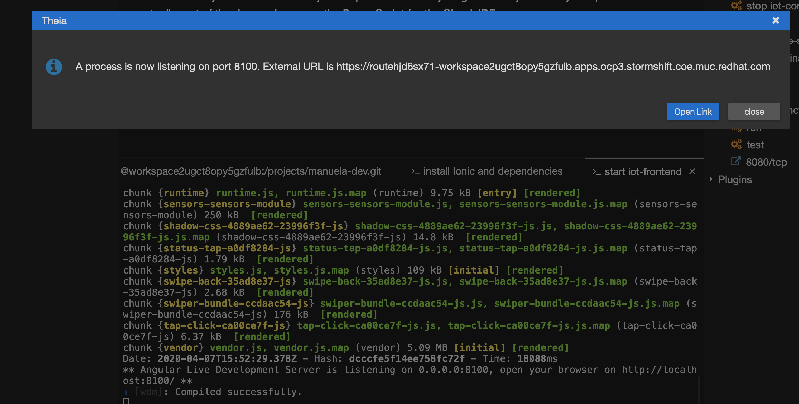
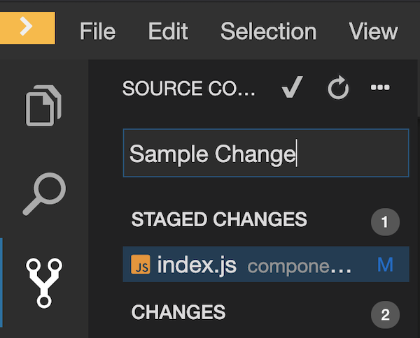
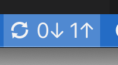

# Code Change Setup
This describes the setup required to demo the code change module.
## Table of Contents
TODO:

## Development
***Optional:***  
You only need to install this if you intend to develop the demo application. This will provide you with an AMQ Broker and configurations to build and deploy the container images in the iotdemo namespace.

Adjust the ```~/manuela-dev/components/iot-frontend/manifests/iot-frontend-configmap.yaml``` ConfigMap to the target environment (Note: the software sensor components uses the internal service name to reach the AMQ broker, therefore do not need adjustments):

```bash
diff --git a/components/iot-frontend/manifests/iot-frontend-configmap.yaml b/components/iot-frontend/manifests/iot-frontend-configmap.yaml

index dac9161..363152e 100644
--- a/components/iot-frontend/manifests/iot-frontend-configmap.yaml
+++ b/components/iot-frontend/manifests/iot-frontend-configmap.yaml

@@ -5,7 +5,7 @@ metadata:
 data:
   config.json: |-
     {
-        "websocketHost": "http://iot-consumer-iotdemo.apps.ocp4.stormshift.coe.muc.redhat.com",
+        "websocketHost": "http://iot-consumer-iotdemo.apps.ocp3.stormshift.coe.muc.redhat.com",
         "websocketPath": "/api/service-web/socket",
         "SERVER_TIMEOUT": 20000
     }
\ No newline at end of file
```

Instantiate the development environment. Note: this will kick off a build of all components which will take several minutes.

```bash
cd ~/manuela-dev
oc apply -k namespaces_and_operator_subscriptions/iotdemo
oc apply -k components
```

## CodeReadyWorkspaces
***Optional:***  
If you want to demo the code change story line using CodeReady Workspaces instead of a local dev environment (or a simple git commit/push), you need to setup Code Ready Workspaces.
### Install CRW 
Duration: 5 Minutes  
This provides CodeReady Workspaces as alternative development environment.

```bash
cd ~/manuela-dev
oc apply -k namespaces_and_operator_subscriptions/manuela-crw
oc apply -k infrastructure/crw
```

This will create the following:

1. Create a new project manuela-crw in the current logged in OCP
1. Create an OperatorGroup CR to make the OLM aware of an operator in this namespace
1. Create an CRW Operator Subscription from the latest stable channel -> installs the CRW operator in the namespace manuela-crw
1. Create an actual CheCluster in the namespace manuela-crw with following custom properties:
```yaml
customCheProperties:
  CHE_LIMITS_USER_WORKSPACES_RUN_COUNT: '10'
  CHE_LIMITS_WORKSPACE_IDLE_TIMEOUT: '-1'
```

### Check CRW 
Duration: 5 Minutes  
CRW should be available after about 3-5 minutes after the previous installation steps.
1. Check and wait that the pods are online:
    ```bash
    oc project manuela-crw
    oc get pods
    NAME                                  READY   STATUS    RESTARTS   AGE
    codeready-7898fc5f74-qz7bk            1/1     Running   0          4m59s
    codeready-operator-679f5fbd6b-ldsbq   1/1     Running   0          8m2s
    devfile-registry-58cbd6787f-zdfhb     1/1     Running   0          6m11s
    keycloak-567744bfd6-dx2hs             1/1     Running   0          7m15s
    plugin-registry-6974f58d59-vh5hc      1/1     Running   0          5m43s
    postgres-55ccbdccb-cnnbc              1/1     Running   0          7m48s
    ```

1. check that you can login. Look for the route with the name **codeready:**
```bash
echo https://$(oc -n manuela-crw get route codeready -o jsonpath='{.spec.host}')
```
Point your browser to the URL and  use your OpenShift Account (OpenShift OAuth is enabled) to login.  
***Bookmark that URL !***

### Create workspace 
Duration: 10 minutes  
This creates your MANUela Cloud IDE workspace.
Click on this link [https://codeready-manuela-crw.apps.ocp3.stormshift.coe.muc.redhat.com/f?url=https://github.com/sa-mw-dach/manuela-dev](https://codeready-manuela-crw.apps.ocp3.stormshift.coe.muc.redhat.com/f?url=https://github.com/sa-mw-dach/manuela-dev) to create/clone your manuela-dev workspace in the CRW instance in the Stormshift OCP3 cluster.

By clicking the link above, CRW will start searching for a devfile.yaml in the root of the git repository. The devfile.yaml is the specification of a CodeReady workspace, i.e. what plugins, languages to provide etc.

After 4-5 minutes, the workspace should be open in your browser.

If not:
*  try to reload the page in the browser, or re-create the workspace from the CRW Dashboard.

* If the commands and plugins are missing.

    * From the CRW Workspaces, Choose the Configure Action:

    * 

    * Stop the workspace: 

    * In the Devfile Section,  add the "components:" and "commands:" section from this file: [https://github.com/sa-mw-dach/manuela-dev/blob/master/devfile.yaml](https://github.com/sa-mw-dach/manuela-dev/blob/master/devfile.yaml)

    * Start the workspace again

    * Make sure the git repo path is "manuela-dev". Sometimes it is "manuela-dev.git", which does not work. If it is with ".git" extension, you can simply right click and rename it.

### Prepare the Workspace 
Duration: 15 Minutes  
The devfile sets up a CRW workspace with all components setup in the local workspace (like you would have on your laptop):
* AMQ 7.5 message broker
* Java (SpringBoot) container for iot-software-sensor
* NodeJS container for iot-consumer
* angular/ionic container for iot-frontend
All these components run as separate containers inside the workspace pod.

There are runtimes and commands to help you do development.
For this to work, the workspace needs to be prepared / initialized, e.g. by downloading required dependencies etc.
There are commands prepared for this, you just have to execute them:
On the right hand side, find the user runtimes.

There you find the runtimes and commands. You can execute them by clicking on the command. Use the following sequence:
1. amq - make sure it is green, meaning AMQ is running already
1. iot-software-sensor
    * "run"
1. iot-consumer
    * "install dependencies"
    * "start iot-consumer" 
1. iot-frontend
    * "install ionic and dependencies". Watch the logs, there might be a question popping up! answer as you like. This step is required only the first time you start the workspace.
    * "Update iot-consumer URL config". This command reads the dynamic route for the iot-consumer component and updates the config file in iot-frontend. It prompts for an OpenShift Login. Please login to the local OpenShift with as user who has the permission to execute 'oc get route'. If it does not work, please manually change the route as described in the following step.  
    * Before you can start the frontend, you need to adapt the config to point the iot-consumer. Therefore, open manuela-dev/components/iot-frontend/src/conf/config.json. Replace the websocket path from "localhost" with the URL from the iot-consumer (click on the iot-consumer "link" in the runtimes). Should like like this: 

    * "start iot-frontend". This brings up the frontend serving component. Once it is running, you see the popup from crw on how to reach it: 
    You can either press "OpenLink", or use the next step.
    * Use "iot-frontend" link to open the "local" running frontend in your browser.

Voilá! Now you have all components running locally in your workspace.

Make sure you can push to the git repo. Commit a dummy change:  


Then push it using the sync button:  


You will be asked for your git credentials. If you have 2FA enabled in git, be sure to use your personal access token as password.

Logout ouf CRW to be prepared for the demo day:
1. Open the CRW side panel by clicking the yellow ">" on the upper left corner
1. Logout using the panel at the lower left corner in the CRW side panel

