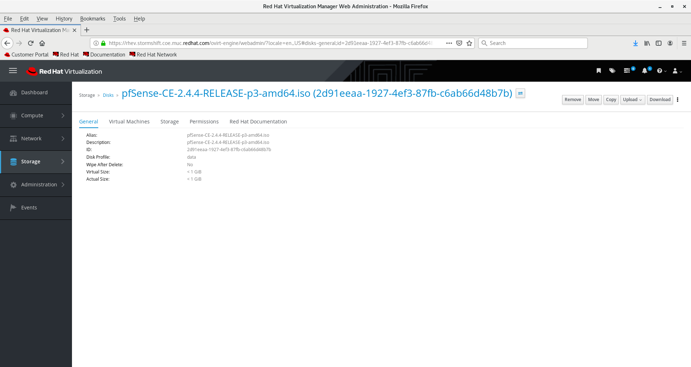

# Firewall setup
**OPTIONAL:**
This documents describes how to setup two virtual firewalls (runnin in VMs) and how to deploy an operator that configures these firewall using a gitops approach.

## Table of Content <!-- omit in toc -->
TODO: Generate this 

## ArgoCD deployment agent configuration

Ensure that ArgoCD is running on and able to manage the management cluster(s). See the instructions for the [Factory Datacenter & Line Data Server](#factory-datacenter--line-data-server-mandatory) for details. Create the deployment agent configuration:

```bash
cd ~/manuela-gitops/meta/
oc apply -n argocd -f argocd-nwpath-<cluster1>-<cluster2>.yaml
```

## Set Up pfSense Firewall VM

Download pfSense ISO (CD/DVD) image from [https://www.pfsense.org/download/](https://www.pfsense.org/download/) and upload the ISO image to your virtualization environment, e.g. [https://rhev.stormshift.coe.muc.redhat.com/](https://rhev.stormshift.coe.muc.redhat.com/).



Create 2 new VMs (mpfuetzn-ocp3-pfsense and mpfuetzn-ocp4-pfsense) as follows:


Add Network Interfaces. Nic1 (LAN) needs to be in a routable network reachable from the management cluster, such as ovirtmgmt for RHV. For example:


(replace ocp3 for ocp4 in the second machine!)

Attach the CD-ISO image to the VM to boot from for the first time

After install, and after the first reboot (do not forget to remove the CD-ISO Image!) configure as follows:
* NO VLANS
* WAN interface is vtnet1 (aka the ocp3-network)
* LAN interface is vtnet0 (aka the ovirtmgt network)
* LAN now also needs a fix IP and a router: ocp3 has 10.32.111.165/20 as IP and 10.32.111.254 as router, ocp4 has 10.32.111.166/20 as ip and the same router
* WAN gets its IP via DHCP in the range of 172.16.10.???/24

Default password for the appliances is admin/pfsense

## Set root ssh key

For the demo ssh-access needs to additionally be enabled and keys generated, because the operator needs to be able to access the pfsense appliance via ansible. Generate a keypair which will be used to access the demo

```
$ ssh-keygen -f keypair

Generating public/private rsa key pair.
Enter passphrase (empty for no passphrase):
Enter same passphrase again:
Your identification has been saved in keypair.
Your public key has been saved in keypair.pub.
The key fingerprint is:
SHA256:e2hUI5thMlfnCCpLW3gS1ClipfGywPYY391+SrO8xx4 vagrant@ibm-p8-kvm-03-guest-02.virt.pnr.lab.eng.rdu2.redhat.com
The key's randomart image is:
+---[RSA 2048]----+
|  .o+. .. . .    |
|. o+.oo. o +     |
|.=o.*.* = + .    |
|..=+.B.=.* .     |
| ..oo. .S.       |
|       ..o       |
|        ++oE     |
|       .o.=o.    |
|         =+.     |
+----[SHA256]-----+

$ cat keypair.pub
ssh-rsa AAAAB3NzaC1yc2EAAAADAQABAAABAQCw5CP4Sj1qp6cLb2Bp6grN59qOUuBrOfz7mc12848TP+PyLtS8KL6GBpb0ySOzEMIJdxhiZNHLiSLzh7mtHH0YXTdErdjD2hK9SOt9OmJrys8po9BLhVvacdRDS0l2BFyxG7gaCU92ZmTJHKtLi2jpOLMFNXl5oSva0u5WL+iYQJhgBCezxCSKhUquxLL9Ua9NThkhb064xzm7Vw0Qx53VY89O6dOX7MFeLM19YT1jfLDJ0CGWNju3dyFbQNNmn/ZquP91DFeV9mTS2lP/H+bd20osDScEzE+c3zeDsP8UmLbOhBsQs6kRXLos58Ag3vjCommULfPnHvTFbgVKbwnh [vagrant@ibm-p8-kvm-03-guest-02.virt.pnr.lab.eng.rdu2.redhat.com](mailto:vagrant@ibm-p8-kvm-03-guest-02.virt.pnr.lab.eng.rdu2.redhat.com)
```
Log into pfsense firewall with default username/pw
```
$ ssh root@10.32.111.165

The authenticity of host '10.32.111.165 (10.32.111.165)' can't be established.
ED25519 key fingerprint is SHA256:ZoXQTnMit+NaHMvQbfTPT3/ztn+xkUB7BrVSptxjBvg.
Are you sure you want to continue connecting (yes/no)? yes
Warning: Permanently added '10.32.111.165' (ED25519) to the list of known hosts.
Password for root@pfSense.localdomain:

pfSense - Netgate Device ID: 445f648407f99eee6675

*** Welcome to pfSense 2.4.4-RELEASE-p3 (amd64) on pfSense ***
 WAN (wan)       -> vtnet1     -> v4/DHCP4: 172.16.10.102/24
 LAN (lan)       -> vtnet0     -> v4: 10.32.111.165/20
 1) Logout (SSH only)                  9) pfTop
 2) Assign Interfaces                 10) Filter Logs
 3) Set interface(s) IP address       11) Restart webConfigurator
 4) Reset webConfigurator password    12) PHP shell + pfSense tools
 5) Reset to factory defaults         13) Update from console
 6) Reboot system                     14) Disable Secure Shell (sshd)
 7) Halt system                       15) Restore recent configuration
 8) Ping host                         16) Restart PHP-FPM
 9) Shell
Enter an option: **8**

[2.4.4-RELEASE][root@pfSense.localdomain]/root: cat >>.ssh/authorized_keys

ssh-rsa AAAAB3NzaC1yc2EAAAADAQABAAABAQCw5CP4Sj1qp6cLb2Bp6grN59qOUuBrOfz7mc12848TP+PyLtS8KL6GBpb0ySOzEMIJdxhiZNHLiSLzh7mtHH0YXTdErdjD2hK9SOt9OmJrys8po9BLhVvacdRDS0l2BFyxG7gaCU92ZmTJHKtLi2jpOLMFNXl5oSva0u5WL+iYQJhgBCezxCSKhUquxLL9Ua9NThkhb064xzm7Vw0Qx53VY89O6dOX7MFeLM19YT1jfLDJ0CGWNju3dyFbQNNmn/ZquP91DFeV9mTS2lP/H+bd20osDScEzE+c3zeDsP8UmLbOhBsQs6kRXLos58Ag3vjCommULfPnHvTFbgVKbwnh vagrant@ibm-p8-kvm-03-guest-02.virt.pnr.lab.eng.rdu2.redhat.com**

[2.4.4-RELEASE][root@pfSense.localdomain]/root: exit

exit

pfSense - Netgate Device ID: 445f648407f99eee6675

*** Welcome to pfSense 2.4.4-RELEASE-p3 (amd64) on pfSense ***
 WAN (wan)       -> vtnet1     -> v4/DHCP4: 172.16.10.102/24
 LAN (lan)       -> vtnet0     -> v4: 10.32.111.165/20
 0) Logout (SSH only)                  9) pfTop
 1) Assign Interfaces                 10) Filter Logs
 2) Set interface(s) IP address       11) Restart webConfigurator
 3) Reset webConfigurator password    12) PHP shell + pfSense tools
 4) Reset to factory defaults         13) Update from console
 5) Reboot system                     14) Disable Secure Shell (sshd)
 6) Halt system                       15) Restore recent configuration
 7) Ping host                         16) Restart PHP-FPM
 8) Shell
Enter an option: **^D**
Connection to 10.32.111.165 closed.
```
## Install & Prepare the firewall operator 
Do the following  once per firewall instance.

Each firewall instance is represented by a namespace in the management cluster. These namespaces have to match the namespaces in the ```~/manuela-gitops/meta/argocd-nwpath-<cluster1>-<cluster2>.yaml``` files. Create the namespace via oc command. Replace manuela-networkpathoperator with your chosen namespace in the subsequent command examples.

```bash
oc new-project manuela-networkpathoperator
```

Prepare a secret for the operator deployment. Adjust hostname, username, SSH private key for firewall access as created before.

```bash
cd ~/manuela-dev/networkpathoperator/firewallrule/deploy
cp firewall-inventory-secret-example.yaml firewall-inventory-secret.yaml
vi firewall-inventory-secret.yaml
```

Deploy operator to new namespace:

```bash
cd ~/manuela-dev
oc project manuela-networkpathoperator
oc apply -n manuela-networkpathoperator -f networkpathoperator/firewallrule/deploy/firewall-inventory-secret.yaml
oc apply -k networkpathoperator/firewallrule/deploy
```

Test the sample firewall rule:
```bash
oc apply -n manuela-networkpathoperator -f deploy/crds/manuela.redhat.com_v1alpha1_firewallrule_cr.yaml
```

Validate that the firewall rule in deploy/crds/manuela.redhat.com_v1alpha1_firewallrule_cr.yaml is created appropriately in the firewall **(via firewall UI)**. Then remove the firewall rule:

```bash
oc delete -n manuela-networkpathoperator -f deploy/crds/manuela.redhat.com_v1alpha1_firewallrule_cr.yaml
```
Validate that the firewall rule in deploy/crds/manuela.redhat.com_v1alpha1_firewallrule_cr.yaml is removed appropriately from the firewall **(via firewall UI)**.
