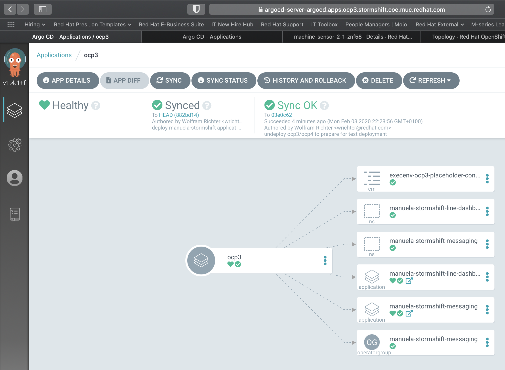
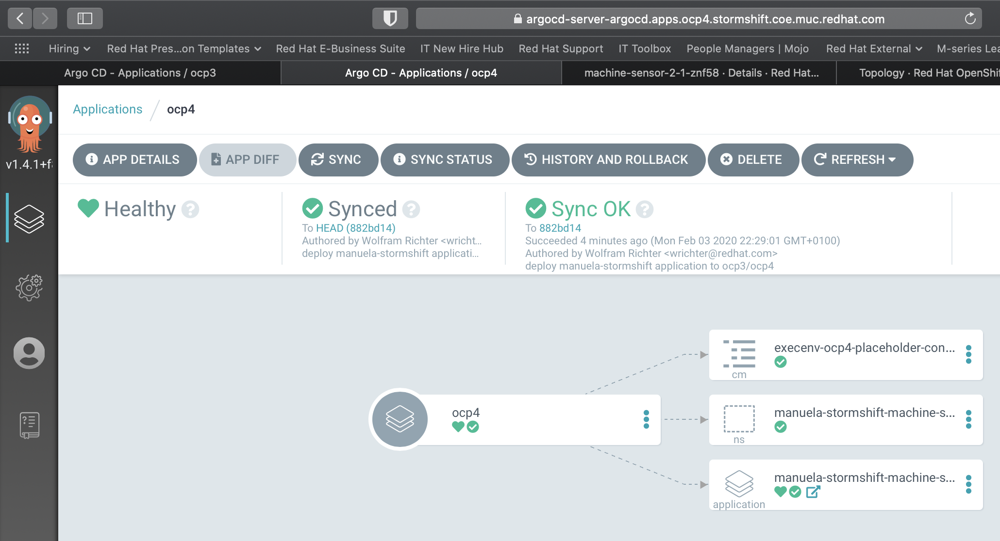
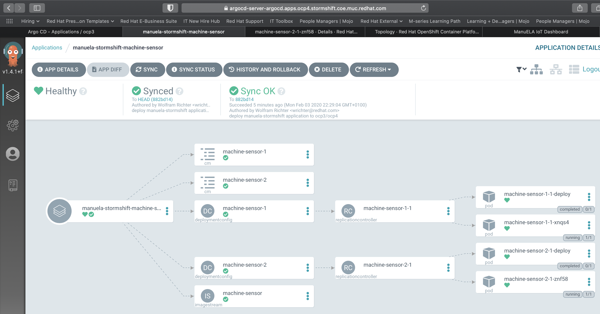
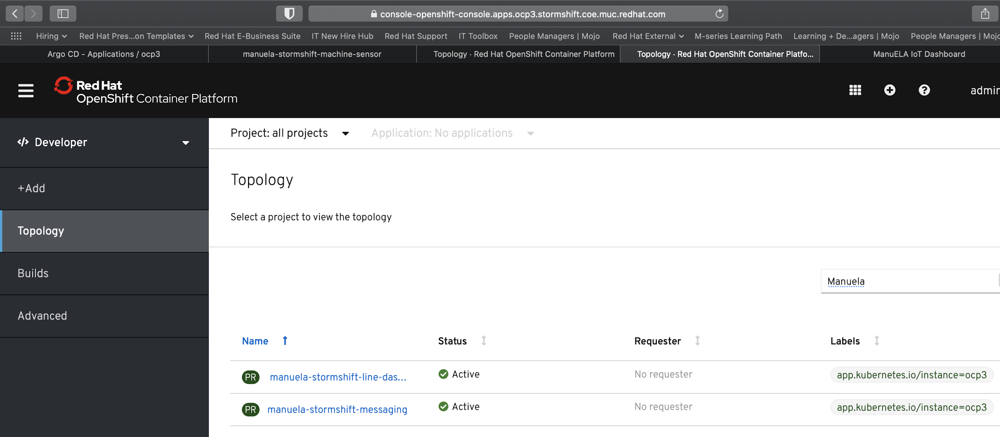
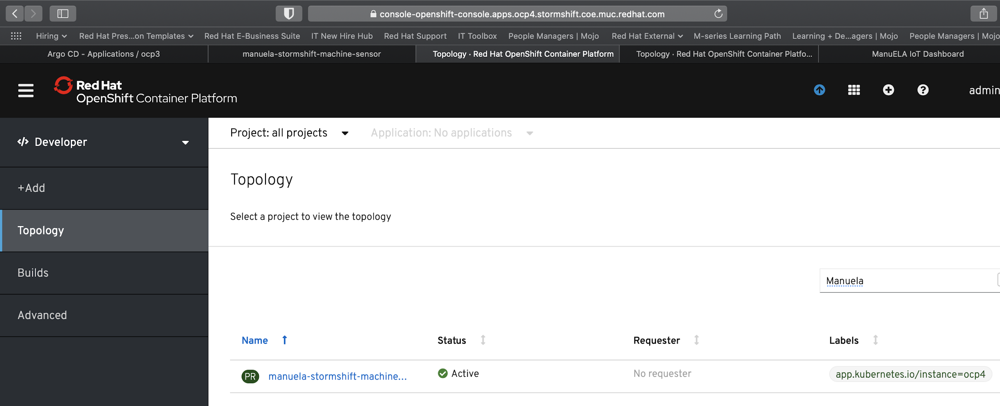

# Gitops App Deployment <!-- omit in toc -->
This document describes how to prepare & execute the basic gitops app deployment demo

- [Prerequisites](#Prerequisites)
- [Demo Preparation](#Demo-Preparation)
  - [Ensure that deployment dir is empty for target execution environments](#Ensure-that-deployment-dir-is-empty-for-target-execution-environments)
  - [Sync ArgoCD](#Sync-ArgoCD)
  - [Validate Application Namespaces & Components no longer exist in OpenShift (and ArgoCD)](#Validate-Application-Namespaces--Components-no-longer-exist-in-OpenShift-and-ArgoCD)
- [Demo Execution](#Demo-Execution)
  - [Show empty environment(s) & empty ArgoCD UI](#Show-empty-environments--empty-ArgoCD-UI)
  - [Optional: Show current Firewall configuration](#Optional-Show-current-Firewall-configuration)
  - [Review GitOps Application Configuration & Deployment approach](#Review-GitOps-Application-Configuration--Deployment-approach)
    - [Application Templating Concept](#Application-Templating-Concept)
    - [Application Instance configuration (in demo storyline: create app instance configuration)](#Application-Instance-configuration-in-demo-storyline-create-app-instance-configuration)
    - [Review app deployment information](#Review-app-deployment-information)
  - [Deploy application](#Deploy-application)
    - [Wait or trigger ArgoCD sync / Explain GitOps Repo Structure](#Wait-or-trigger-ArgoCD-sync--Explain-GitOps-Repo-Structure)
    - [Show application being deployed in ArgoCD](#Show-application-being-deployed-in-ArgoCD)
    - [Show application being deployed on OpenShift](#Show-application-being-deployed-on-OpenShift)
    - [Show running application](#Show-running-application)
  - [Optional: Show Firewall configuration change](#Optional-Show-Firewall-configuration-change)
- [Mini Demo recording](#Mini-Demo-recording)

## Prerequisites

The demo environment(s) have been [bootstrapped](BOOTSTRAP.md).

## Demo Preparation

### Ensure that deployment dir is empty for target execution environments

The following example uses the OCP3+OCP4 execution environments, adapt accordingly when deploying to crc.

Make sure you do NOT move or delete the execenv-<targetenv>-placeholder-configmap to undeploy, otherwise you won’t be able to sync via ArgoCD UI
```bash
cd ~/manuela-gitops/deployment
ls execenv-ocp3

execenv-ocp3-placeholder-configmap.yaml			manuela-stormshift-line-dashboard-namespace.yaml	manuela-stormshift-messaging-namespace.yaml
manuela-stormshift-line-dashboard-application.yaml	manuela-stormshift-messaging-application.yaml		manuela-stormshift-messaging-operatorgroup.yaml

ls execenv-ocp4

execenv-ocp4-placeholder-configmap.yaml			manuela-stormshift-machine-sensor-application.yaml	manuela-stormshift-machine-sensor-namespace.yaml
```
The deployment are just symlinks, therefore simply delete the links
```bash
rm execenv-ocp3/manuela-stormshift*
rm execenv-ocp4/manuela-stormshift* 
rm nwpath-ocp3-ocp4/*
```

Commit changes to Git
```bash
cd ~/manuela-gitops
git add .
git commit -m "undeploy ocp3/ocp4 to prepare for test deployment"

[master 03e0c62] undeploy ocp3/ocp4 to prepare for test deployment
 7 files changed, 0 insertions(+), 0 deletions(-)
 rename deployment/{execenv-ocp3 => undeployed}/manuela-stormshift-line-dashboard-application.yaml (100%)
 rename deployment/{execenv-ocp3 => undeployed}/manuela-stormshift-line-dashboard-namespace.yaml (100%)
 rename deployment/{execenv-ocp4 => undeployed}/manuela-stormshift-machine-sensor-application.yaml (100%)
 rename deployment/{execenv-ocp4 => undeployed}/manuela-stormshift-machine-sensor-namespace.yaml (100%)
 rename deployment/{execenv-ocp3 => undeployed}/manuela-stormshift-messaging-application.yaml (100%)
 rename deployment/{execenv-ocp3 => undeployed}/manuela-stormshift-messaging-namespace.yaml (100%)
 rename deployment/{execenv-ocp3 => undeployed}/manuela-stormshift-messaging-operatorgroup.yaml (100%)

git push

Enumerating objects: 11, done.
Counting objects: 100% (11/11), done.
Delta compression using up to 4 threads
Compressing objects: 100% (6/6), done.
Writing objects: 100% (6/6), 925 bytes | 462.00 KiB/s, done.
Total 6 (delta 4), reused 0 (delta 0)
remote: Resolving deltas: 100% (4/4), completed with 4 local objects.
To https://github.com/sa-mw-dach/manuela-gitops.git
   f583608..03e0c62  master -> master
```
### Sync ArgoCD

This should happen automatically, but can be triggered through the ArgoCD UI and/or CLI


### Validate Application Namespaces & Components no longer exist in OpenShift (and ArgoCD)

E.g. via UI or CLI (see Logins & URL Chapter for Links)
```bash
**oc get projects | grep manu**
```


## Demo Execution

In the App Deployment GitOps demo you will deploy the an application over multiple environments, consisting of sensor(s), messaging layer with AMQ Broker and the web app.

### Show empty environment(s) & empty ArgoCD UI

Same as during [demo prep](#Validate-Application-Namespaces--Components-no-longer-exist-in-OpenShift-and-ArgoCD).

### Optional: Show current Firewall configuration
TODO

### Review GitOps Application Configuration & Deployment approach

Depending on the audience, this can be done quickly or in depth

#### Application Templating Concept
```bash
cd manuela-gitops/config/templates
```
multiple application templates exist (which can even reference one another)
```bash
ls

manuela		manuela-openshift	manuela-openshift-prod
```
Each application component has is configured in its own directory
```bash
ls manuela/

line-dashboard	machine-sensor	messaging
```
A component is configured via kustomize & k8s manifests (maybe explain kustomize here already)
```bash
ls manuela/machine-sensor/

kustomization.yaml			machine-sensor-dc.yaml			machine-sensor-is.yaml			service-client-messaging-configmap.yaml
```
Point out that some configuration parameters need to be adjusted for an application instance spanning namespaces or clusters
```bash
less manuela/machine-sensor/machine-sensor-1-configmap.yaml

apiVersion: v1
kind: ConfigMap
metadata:
  name: machine-sensor-1
data:
  APP_NAME: iot-sensor
  DEVICE_ID: pump-2
  DEVICE_METRICS: 'temperature,vibration,gps,light'
  MACHINE_ID: floor-1-line-1-extruder-1
  MQTT_HOSTNAME: broker-amq-mqtt-all-0-svc
  MQTT_PASSWORD: iotuser
  MQTT_PORT: '61616'
  MQTT_TLSSNI: 'false'
  MQTT_USER: iotuser
  SENSOR_GPS_ENABLED: 'false'
  SENSOR_GPS_FINAL_LATITUDE: '40.689879'
  SENSOR_GPS_FINAL_LONGITUDE: '-73.992895'
...
```
#### Application Instance configuration (in demo storyline: create app instance configuration)

Navigate to the application instance of your choice
```bash
cd manuela-gitops/config/instances
ls

manuela-crc		manuela-tst-all	manuela-stormshift

cd manuela-stormshift
ls

line-dashboard	machine-sensor	messaging
```
Review kustomization of machine sensor (name of route is autogenerated by operator based on namespace + svc name)
```bash
ls machine-sensor

kustomization.yaml		machine-sensor-1-configmap.yaml	machine-sensor-2-configmap.yaml

cat machine-sensor/machine-sensor-1-configmap.yaml

apiVersion: v1
kind: ConfigMap
metadata:
  name: machine-sensor-1
data:
  MQTT_HOSTNAME: broker-amq-mqtt-all-0-svc-rte-manuela-stormshift-messaging.apps.ocp3.stormshift.coe.muc.redhat.com
  MQTT_PORT: '80'
```
Review kustomization of messaging layer
```bash
ls messaging

kustomization.yaml	route.yaml

cat messaging/route.yaml

apiVersion: route.openshift.io/v1
kind: Route
metadata:
  name: messaging
spec:
  host: messaging-manuela-stormshift-messaging.apps.ocp3.stormshift.coe.muc.redhat.com
```
Review kustomization of line-dashboard
```bash
ls line-dashboard

kustomization.yaml		line-dashboard-configmap.yaml	line-dashboard-route.yaml

cat line-dashboard/line-dashboard-configmap.yaml

apiVersion: v1
kind: ConfigMap
metadata:
  name: line-dashboard-configmap
data:
  config.json: |-
    {
        "websocketHost": "http://messaging-manuela-stormshift-messaging.apps.ocp3.stormshift.coe.muc.redhat.com",
        "websocketPath": "/api/service-web/socket",
        "SERVER_TIMEOUT": 20000
    }
```
#### Review app deployment information
```bash
cd ~/manuela-gitops/config/instances/manuela-stormshift
```
Explain the individual files and what they represent (namespaces, argoCD applications, operatorgroup, ...)

### Deploy application

GitHub and similar workflows would allow an approval step to be inserted here

Move application deployments to their respective execution envs
```bash
cd ~/manuela-gitops/deployment
ln -s ../../config/instances/manuela-stormshift/manuela-stormshift-line-dashboard-application.yaml execenv-ocp****3
ln -s ../../config/instances/manuela-stormshift/manuela-stormshift-messaging-application.yaml execenv-ocp****3
ln -s ../../config/instances/manuela-stormshift/manuela-stormshift-machine-sensor-application.yaml execenv-ocp****4
```
If the firewall demo is in scope, add links to the appropriate firewall rules
```bash
ln -s ../../config/instances/manuela-stormshift/manuela-stormshift-http-firewallrule.yaml nwpath-ocp3-ocp4
ln -s ../../config/instances/manuela-stormshift/manuela-stormshift-https-firewallrule.yaml nwpath-ocp3-ocp4
```
Commit changes to Git
```bash
cd ~/manuela-gitops
git add .
git commit -m "deploy manuela-stormshift application to ocp3/ocp4"

[master 882bd14] deploy manuela-stormshift application to ocp3/ocp4
 7 files changed, 0 insertions(+), 0 deletions(-)
 rename deployment/{undeployed => execenv-ocp3}/manuela-stormshift-line-dashboard-application.yaml (100%)
 rename deployment/{undeployed => execenv-ocp3}/manuela-stormshift-line-dashboard-namespace.yaml (100%)
 rename deployment/{undeployed => execenv-ocp3}/manuela-stormshift-messaging-application.yaml (100%)
 rename deployment/{undeployed => execenv-ocp3}/manuela-stormshift-messaging-namespace.yaml (100%)
 rename deployment/{undeployed => execenv-ocp3}/manuela-stormshift-messaging-operatorgroup.yaml (100%)
 rename deployment/{undeployed => execenv-ocp4}/manuela-stormshift-machine-sensor-application.yaml (100%)
 rename deployment/{undeployed => execenv-ocp4}/manuela-stormshift-machine-sensor-namespace.yaml (100%)

git push

Enumerating objects: 11, done.
Counting objects: 100% (11/11), done.
Delta compression using up to 4 threads
Compressing objects: 100% (6/6), done.
Writing objects: 100% (6/6), 800 bytes | 800.00 KiB/s, done.
Total 6 (delta 4), reused 0 (delta 0)
remote: Resolving deltas: 100% (4/4), completed with 3 local objects.
To https://github.com/sa-mw-dach/manuela-gitops.git
   03e0c62..882bd14  master -> master
```
#### Wait or trigger ArgoCD sync / Explain GitOps Repo Structure

This can take a couple of minutes, so you could also trigger it via UI or CLI (but this takes away some of the magic). You can fill the time by explaining more of the GitOps Repo Structure (see Background below).

Note that the ArgoCD UI doesn’t self refresh, so you need to reload it to see that the app components have been deployed

#### Show application being deployed in ArgoCD







#### Show application being deployed on OpenShift





#### Show running application


### Optional: Show Firewall configuration change
TODO

## Mini Demo recording

[https://drive.google.com/open?id=1-wsnTpzTCJO821rZlMu5jG6xRmBnptfe](https://drive.google.com/open?id=1-wsnTpzTCJO821rZlMu5jG6xRmBnptfe)