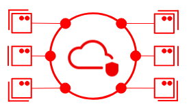
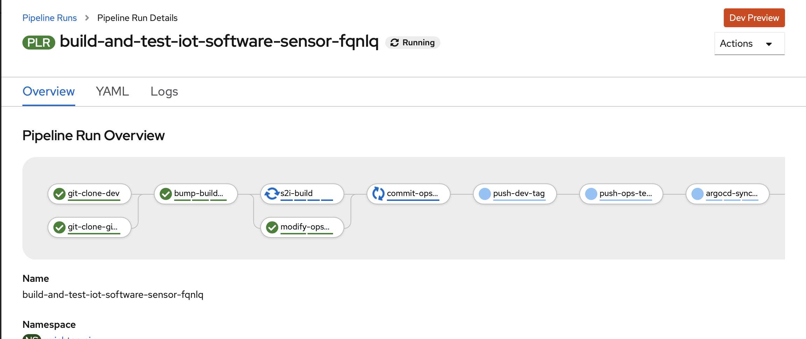
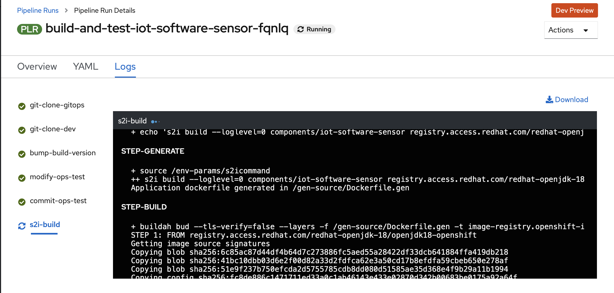
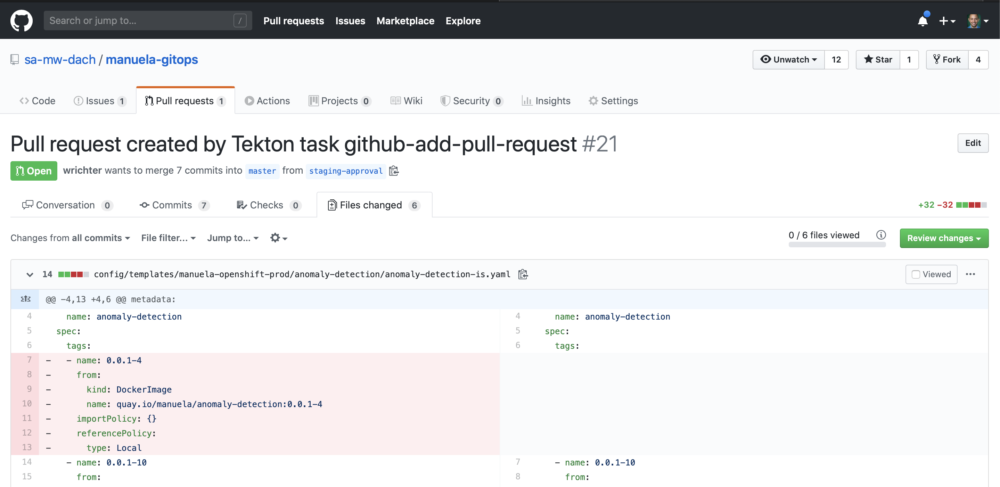

# CI&CD Pipeline & Staging <!-- omit in toc -->
This document describes how to prepare & execute the CI/CD pipeline & staging demo

- [Prerequisites](#Prerequisites)
- [Demo Preparation](#Demo-Preparation)
- [Demo Execution](#Demo-Execution)

## Prerequisites

The demo environment(s) have been [bootstrapped](BOOTSTRAP.md). It is a continuation of the [code change module](module-code-change.md). It can be prepared independently, but needs to be executed after it.

Review the [staging concept](staging-concept.md) and the pipelines [README](https://github.com/sa-mw-dach/manuela-dev/blob/master/tekton/README.md).

## Demo Preparation

Validate that all components in the manuela-tst-all project are working correctly (otherwise the ArgoCD sync task might fail because it waits for all components to come up). If a single component is failing, you can run its build-and-test pipeline to fix the problem (see below). If it's more than one component, you can use the seed pipeline to build and deploy new versions of all components to test and prod.

```bash
oc process -n manuela-ci seed | oc process -n manuela-ci -f -
```

Go to the gitops repo on GitHub and close any pending pull requests. Then delete the "staging-approval" branch.

## Demo Execution

Review the GitHub ops repository and show that currently, only the master branch exists. Explain the [staging concept](staging-concept.md) and the expected creation of a new branch + pull request during the pipeline run.

Once a code change has been performed, committed and pushed to the GitHub dev repository, launch the pipeline via the OpenShift template:

```bash
oc process -n manuela-ci build-iot-consumer | oc process -n manuela-ci -f -
```

Now that the pipeline is running, you have time to review its stages via the OpenShift Pipelines UI:



Explain what is happening, how tasks can run in parallel, that each task is defined as a sequence of steps which are regular containers, etc... Also show the Pipeline logs:



Once the pipeline has deployed the changed version to manuela-tst-all, you can switch over to that project to demonstrate that the new changes are live there (e.g. via the Application UI). This will likely take a while during which the pipeline can run to completion.

The once the build-and-test pipeline completed, it triggers the stage-to-production pipeline. This creates the new branch, pushes the prod ops changes to this branch and creates a pull request to the master branch. 

Go to the ops repo on Github and show that now there is an additional staging-approval branch and that a pull-request has been created.

Review the pull request and merge it. This represents the manual approval to change the production setup (Closing the pull request is equivalent to rejecting the change).



ArgoCD should pick up these changes after a short while, so you can then demo that the changes are actually applied to production as well.