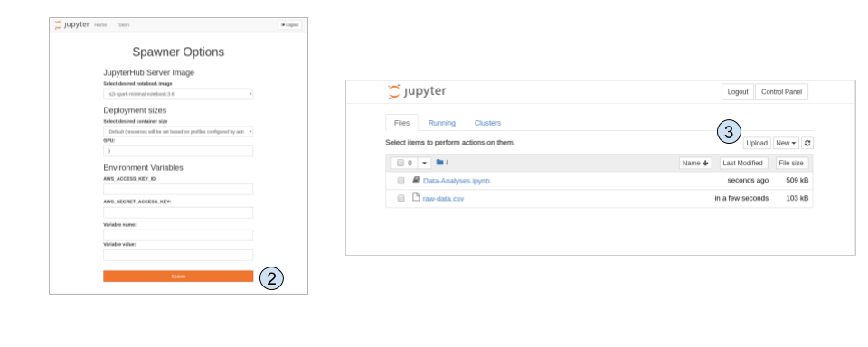

# Machine Learning <!-- omit in toc -->
This document describes how to prepare & execute the machine learning demo

- [Prerequisites](#prerequisites)
- [Demo Preparation](#demo-preparation)
  - [Pre Demo Checks](#pre-demo-checks)
  - [Deploy OpenDataHub with Jupyter and Seldon in the Manuela-ML-Workspace](#deploy-opendatahub-with-jupyter-and-seldon-in-the-manuela-ml-workspace)
- [Demo Execution](#demo-execution)
  - [Demo ML modeling](#demo-ml-modeling)

## Prerequisites

The demo based environment have been [bootstrapped](BOOTSTRAP.md).

[See Machine Learning based Anomaly Detection and Alerting](BOOTSTRAP.md#machine-learning-based-anomaly-detection-and-alerting-optional)

## Demo Preparation

The demo prepation is focusing on the Data Scientist workbench which is a OpenShift powered  [Open Data Hub](https://opendatahub.io/).

Environments:
- OCP3: Predeployed Manuela-ML-Workspace
- OCP4: Deploy Manuela-ML-Workspace during the demo (optional)
- CRC: Deploy the Manuela-ML-Workspace in you own environments for any use case

This guide assumes that you are using the stormshift environment.

### Pre Demo Checks
- Ensurure that the Manuela-ML-Workspace is deployed and functioning on OCP3
- Delete the Manuela-ML-Workspace of OCP4 in case you like to show the deployment.

### Deploy OpenDataHub with Jupyter and Seldon in the Manuela-ML-Workspace

The Manuela-ML-Workspace should exists or be deployed on **OCP3** before running the demo.
You can deploy the Manuela-ML-Workspace during the demo on **OCP4** or your **CRC** in case you like to show how to deploy the Open Data Hub and upload the Jupyter and training data.

Let's use ocp4 during the following steps. Login into ocp4 as admin or with admin privileges:
```bash
oc login -u XXX -p XXXX --server=https://api.ocp4.stormshift.coe.muc.redhat.com:6443
```

Please clone the  ```manuela-dev``` repository into your home directory. This repo contains everything required to set up the  demo. You can choose a different directory, but the subsequent docs assume it to reside in ~/manuela-dev .

```bash
cd ~
git clone https://github.com/sa-mw-dach/manuela-dev.git
cd  ~/manuela-dev/namespaces_and_operator_subscriptions/manuela-ml-workspace
```


**Deploy OpenDataHub with Jupyter and Seldon in the Manuela-ML-Workspace namespace**
```bash
oc apply -k .
```

Follow the instantiation in the OpenShift Console or using oc:  
```bash
oc get pods -w
```

**Launch a Jupyterhub**  
Get the jupyterhub Url either from the route in the OpenShift Console or using oc::

```bash

echo https://$(oc get route jupyterhub -o jsonpath='{.spec.host}' -n manuela-ml-workspace )
```
https://jupyterhub-manuela-ml-workspace.apps.ocp4.stormshift.coe.muc.redhat.com

1. Login with OpenShift credentials
2. Spwan a notebook using the defaults
3. Upload ```Data-Analyses.ipynb``` and ```raw-data.csv``` from ```~/manuela-dev/ml-models/anomaly-detection/```
   




## Demo Execution


### Demo ML modeling

**Data collection and labeling**

**Demo the notebook**

Open the notebook ```Data-Analyses.ipynb```

Option 1: Lightweigt demo
- All output cells are populated. Don't run any cells. 
- Walk through the content and explain the high level flow.

Option 2: Full demo
- Clear current outputs: ```Cell``` -> ```All Output``` -> ```Clear```
- Run each cell \[Shift]\[Enter] and explain each step. 

**Demo model serving**

**Demo the pipeline**
